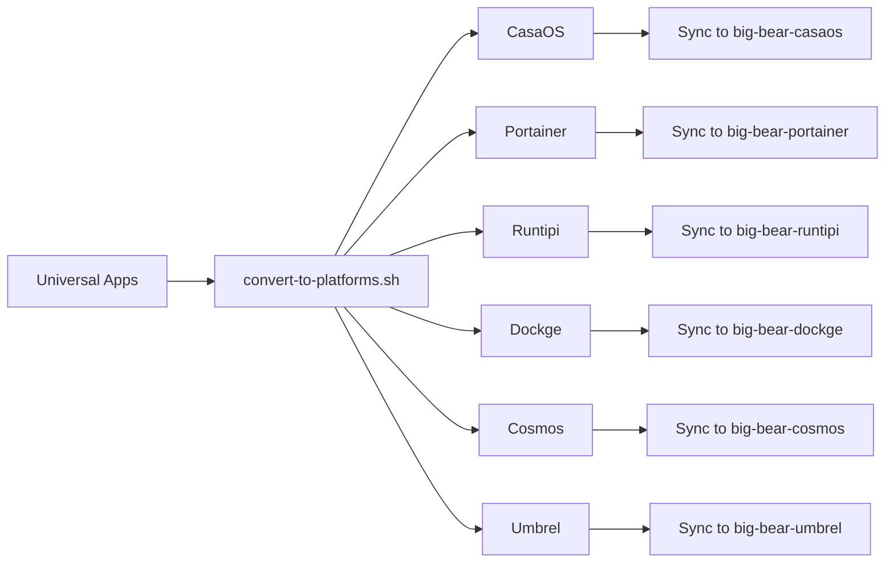

# Big Bear Universal Apps

The **Big Bear Universal Apps** repository is the **single source of truth** for all Big Bear app definitions. Apps are maintained in a universal, platform-agnostic format and automatically converted to platform-specific formats.

## 🎯 Overview

This repository serves as the central hub for Big Bear app definitions. All apps are stored in a standardized universal format and converted to various platform-specific formats:

- **CasaOS** - Home server operating system
- **Portainer** - Container management platform
- **Runtipi** - Self-hosted app platform
- **Dockge** - Docker compose management
- **Cosmos** - Reverse proxy and app platform
- **Umbrel** - Personal server OS

## 📁 Repository Structure

```
big-bear-universal-apps/
├── apps/                      # Universal app definitions (source of truth)
│   ├── jellyseerr/
│   │   ├── app.json          # App metadata and configuration
│   │   └── docker-compose.yml # Standard Docker Compose file
│   ├── plex/
│   └── ...
├── converted/                 # Platform-specific converted apps (generated)
│   ├── casaos/
│   ├── portainer/
│   ├── runtipi/
│   ├── dockge/
│   ├── cosmos/
│   └── umbrel/
├── schemas/                   # JSON schemas for validation
│   └── app-schema-v1.json
├── scripts/                   # Conversion and management scripts
│   ├── convert-to-platforms.sh
│   ├── migrate-from-casaos.sh
│   └── validate-apps.sh
├── SCHEMA.md                  # Universal format documentation
└── README.md                  # This file
```

## 🚀 Quick Start

### Adding a New App

1. **Create app directory:**
   ```bash
   mkdir -p apps/myapp
   ```

2. **Create `app.json`** with app metadata (see [SCHEMA.md](SCHEMA.md) for format)

3. **Create `docker-compose.yml`** with a clean, standard Docker Compose file

4. **Convert to all platforms:**
   ```bash
   ./scripts/convert-to-platforms.sh -a myapp
   ```

### Converting All Apps

```bash
# Convert all apps to all platforms
./scripts/convert-to-platforms.sh

# Convert to specific platforms only
./scripts/convert-to-platforms.sh -p casaos,portainer,runtipi

# Dry run (preview without making changes)
./scripts/convert-to-platforms.sh --dry-run
```

## 📝 Universal App Format

Apps in this repository use the **Universal App Format** - a comprehensive, platform-agnostic format that contains all necessary metadata and configuration.

### Key Components

1. **`app.json`** - Contains all metadata:
   - App information (name, description, version)
   - Visual assets (icons, thumbnails)
   - Technical requirements (architectures, ports)
   - Deployment configuration
   - Platform compatibility flags

2. **`docker-compose.yml`** - Standard Docker Compose file:
   - Clean, no platform-specific extensions
   - Uses relative paths (e.g., `./data`)
   - Standard Docker Compose v3+ format

See [SCHEMA.md](SCHEMA.md) for complete format documentation and examples.

## 🔄 Conversion Workflow



The conversion process:
1. Read universal format from `apps/`
2. Convert to platform-specific formats
3. Output to `converted/<platform>/`
4. Sync converted apps to platform repositories
5. Create pull requests for updates

## 🛠️ Scripts

### `convert-to-platforms.sh`

Converts universal apps to all platform formats.

```bash
# Usage
./scripts/convert-to-platforms.sh [OPTIONS]

# Options
-h, --help              Show help message
-i, --input DIR         Input directory (default: ./apps)
-o, --output DIR        Output directory (default: ./converted)
-p, --platforms LIST    Comma-separated platform list
-a, --app NAME          Convert specific app only
--dry-run              Preview without changes
-v, --verbose          Verbose output

# Examples
./scripts/convert-to-platforms.sh                    # Convert all apps
./scripts/convert-to-platforms.sh -a jellyseerr      # Convert one app
./scripts/convert-to-platforms.sh -p casaos,runtipi  # Specific platforms
```

## 🧪 Validation

Validate apps against the JSON schema:

```bash
# Validate all apps
./scripts/validate-apps.sh

# Validate specific app
./scripts/validate-apps.sh -a jellyseerr
```

## 📊 Apps

| Application | Description | Docker Image | Version | Port | YouTube | Docs |
| --- | --- | --- | --- | --- | --- | --- |
| **2FAuth** | A Web app to manage your Two-Factor Authentication (2FA) accounts and generate their security codes | `2fauth/2fauth` | 5.6.0 | 8000 | [▶️](https://youtu.be/yCnjxSryD_U) |  |
| **Actual Budget** | Actual Budget is a super fast and privacy-focused app for managing your finances. At its heart is... | `actualbudget/actual-server` | 25.10.0 | 5006 | [▶️](https://youtu.be/fa8j7ZfkYaM) |  |
| **AdGuard Home** | AdGuard Home is a network-wide software for blocking ads and tracking. After you set it up, it'll... | `adguard/adguardhome` | 0.107.68 | 8080 | [▶️](https://youtu.be/6cu0kfP50Jg) |  |
| **AdGuard Home (HOST)** | Use if you're going to use Adguard Home as a DHCP server. AdGuard Home is a network-wide software... | `adguard/adguardhome` | 0.107.68 | 80 |  |  |
| **Anse** | Anse is a fully optimized UI for AI Chats. Supercharged experience for multiple models such as Ch... | `ddiu8081/anse` | v1.1.11 | 8014 |  |  |
| **Ansible Semaphore** | Ansible Semaphore is a modern UI for Ansible. It lets you easily run Ansible playbooks, get notif... | `semaphoreui/semaphore` | 2.16.34 | 3000 |  |  |
| **Appsmith** | Low code project to build admin panels, internal tools, and dashboards, integrating 15+ databases. | `appsmith/appsmith-ee` | 1.73.1 | 1080 |  |  |
| **Audiobookshelf** | Audiobookshelf is a self-hosted audiobook server for managing and playing your audiobooks. Audiob... | `ghcr.io/advplyr/audiobookshelf` | 2.30.0 | 8080 |  |  |
| **Authentik** | Authentik is a self-hosted identity and access management platform that provides a secure and sca... | `ghcr.io/goauthentik/server` | 2025.8.4 | 9443 |  |  |
| **Ayon** | This is the official Docker-based deployment for the Ayon Server. Ayon is a robust tool designed ... | `ynput/ayon` | 1.3.6-20240823 | 5000 |  |  |
| **Baserow** | Create your own online database without technical experience. Our user-friendly no-code tool give... | `baserow/baserow` | 1.35.3 | 7350 | [▶️](https://youtu.be/Xej7sH5bNFs) |  |
| **Beaver Habit Tracker** | A self-hosted habit tracking app without Goals | `daya0576/beaverhabits` | 0.7.3 | 8080 |  |  |
| **Beszel** | A lightweight server resource monitoring hub with historical data, docker stats, and alerts. | `henrygd/beszel` | 0.14.1 | 8090 | [▶️](https://youtu.be/BUVVG-9RCbg) |  |
| **Big Bear CasaOS User Management** | Manage users in CasaOS | `bigbeartechworld/big-bear-casaos-user-management` | 0.1.1 | 5000 | [▶️](https://youtu.be/-a9k8fLAbRE) |  |
| **bookstack** | BookStack is a simple, self-hosted, easy-to-use platform for organising and storing information. ... | `lscr.io/linuxserver/bookstack` | 25.07.20250804 | 8080 | [▶️](https://youtu.be/_jW4RjJm-6A) |  |
| **Brave** | This Image contains a browser-accessible version of Brave. | `kasmweb/brave` | 1.15.0-rolling | 6901 | [▶️](https://youtu.be/CJ2x-yCW-co) |  |
| **btop** | A monitor of resources. Software made by Aristocratos at https://github.com/aristocratos/btop | `bigbeartechworld/big-bear-btop` | 0.1.5 | 7681 | [▶️](https://youtu.be/mD52bujMt68) |  |
| **Budibase** | Low code platform for creating internal tools, workflows, and admin panels in minutes. Supports P... | `budibase/budibase` | 3.22.4 | 8080 |  |  |
| **cAdvisor** | cAdvisor (Container Advisor) provides container users an understanding of the resource usage and ... | `gcr.io/cadvisor/cadvisor` | 0.52.1 | 8085 |  |  |
| **Cal.com** | The open source Calendly successor. You are in charge of your own data, workflow, and appearance.... | `calcom/cal.com` | 5.8.2 | 3000 |  |  |
| **Change Detection** | The best and simplest free open source website change detection, restock monitor and notification... | `ghcr.io/dgtlmoon/changedetection.io` | 0.50.32 | 5000 |  |  |
| **Chatpad** | Recently, there has been a surge of UIs for ChatGPT, making it the new to-do app that everyone wa... | `ghcr.io/deiucanta/chatpad` | f45cd53bc410412610c1ba1cbd84cd137d8e167d | 8080 |  |  |
| **chrome** | This Image contains a browser-accessible version of chrome. | `kasmweb/chrome` | 1.15.0-rolling | 6902 | [▶️](https://youtu.be/jYm_Ih8VHAs) |  |
| **chromium** | This Image contains a browser-accessible version of chromium. | `kasmweb/chromium` | 1.15.0-rolling | 6902 | [▶️](https://youtu.be/ziy4c4n7KnU) |  |
| **Cloudflared Web** | Cloudflared-web is a docker image that packages both cloudflared cli and a simple Web UI to easil... | `wisdomsky/cloudflared-web` | 2025.10.0 | 14333 | [▶️](https://youtu.be/JvyyolXJ0-A) |  |
| **Code Server** | Run VS Code on any machine anywhere and access it in the browser. | `linuxserver/code-server` | 4.105.1 | 8080 | [▶️](https://youtu.be/aiYcwXDfgE8) |  |
| **CodeX Docs** | CodeX Docs is a free docs application. It's based on Editor.js ecosystem which gives all modern o... | `ghcr.io/codex-team/codex.docs` | 2.2 | 3000 | [▶️](https://youtu.be/dKm2VJwam24) |  |
| **Compose Toolbox** | Self-hosted tool to edit, validate, and get suggestions for docker-compose.yml files. | `ghcr.io/bluegoosemedia/composetoolbox` | latest | 3002 |  | [📖](https://github.com/bluegoosemedia/composetoolbox) |
| **ConvertX** | A self-hosted online file converter. Supports over a thousand different formats. Written with Typ... | `ghcr.io/c4illin/convertx` | 0.15.1 | 3000 |  |  |
| **Coolify** | Coolify is a self-hosted web application that allows you to manage your servers, applications, an... | `ghcr.io/coollabsio/coolify` | 4.0.0-beta.434 | 8000 | [▶️](https://youtu.be/IZ-vOuMR4Kc) |  |
| **Crafty Controller** | Crafty 4 is the next iteration of our Minecraft Server Wrapper / Controller / Launcher. | `registry.gitlab.com/crafty-controller/crafty-4` | 4.5.5 | 8443 | [▶️](https://youtu.be/Vw4su8hT_7A) |  |
| **CyberChef** | CyberChef is a simple, intuitive web app for carrying out all manner of cyber operations within a... | `ghcr.io/gchq/cyberchef` | 10.19.4 | 8080 |  |  |
| **Dashdot** | About A simple, modern server dashboard, primarily used by smaller private servers. | `mauricenino/dashdot` | 6.2.0 | 3001 | [▶️](https://youtu.be/if_fyuX_5fU) |  |
| **Dashy** | Dashy helps you organize your self-hosted services by making them accessible from a single place | `lissy93/dashy` | 3.1.0 | 4000 |  |  |
| **Davis** | A simple, fully translatable admin interface for sabre/dav based on Symfony 5 and Bootstrap 5, in... | `ghcr.io/tchapi/davis-standalone` | 5.2.0 | 9000 |  |  |
| **DBGate** | Web based UI for managing and exploring SQL database data | `dbgate/dbgate` | 6.6.5-alpine | 3000 |  |  |
| **DIUN** | Docker Image Update Notifier is a CLI application written in Go and delivered as a single executa... | `crazymax/diun` | 4.30.0 | N/A |  |  |
| **Docker Cron Restart Notifier** | This Docker image is designed to automatically restart specified Docker containers and send notif... | `deduard/tools` | restart-notifier-latest | N/A |  |  |
| **Dockge** | A fancy, easy-to-use and reactive docker `compose.yaml` stack-oriented manager | `louislam/dockge` | 1.5.0 | 5001 | [▶️](https://youtu.be/8Z6psh-t5iU) |  |
| **Dockpeek** | A lightweight, self-hosted Docker dashboard that provides quick access to all running containers ... | `ghcr.io/dockpeek/dockpeek` | 1.7.0 | 3420 |  |  |
| **Docmost** | Docmost is an open-source alternative to the likes of Notion and Confluence. Whether you're manag... | `docmost/docmost` | 0.23.2 | 3000 |  |  |
| **Dozzle** | Dozzle is a real-time log viewer for docker containers. | `amir20/dozzle` | 8.14.5 | 8888 | [▶️](https://youtu.be/lLLNDcHNOuM) |  |
| **EJBCA Community** | The open-source public key infrastructure (PKI) and certificate authority (CA) software EJBCA is ... | `keyfactor/ejbca-ce` | 9.1.1 | 8443 |  | [📖](https://doc.primekey.com/ejbca/ejbca-introduction) |
| **Erugo** | A powerful, self-hosted file-sharing platform built with PHP and Laravel with a Vue.js frontend. ... | `wardy784/erugo` | 0.1.1 | 9997 |  |  |
| **Eufy Security WS** | eufy-security-ws is a small server wrapper around the eufy-security-client library to access it v... | `bropat/eufy-security-ws` | 1.9.3 | 3000 |  |  |
| **Excalidraw** | Virtual whiteboard for sketching hand-drawn like diagrams | `excalidraw/excalidraw` | latest | 8000 | [▶️](https://youtu.be/T4K6RDhieIA) |  |
| **FarmOS** | farmOS is a web-based application for farm management, planning, and record keeping. It is develo... | `farmos/farmos` | 3.4.5 | 8080 |  |  |
| **Faster-whisper** | Faster-whisper is a reimplementation of OpenAI's Whisper model using CTranslate2, which is a fast... | `linuxserver/faster-whisper` | 2.5.0 | 7575 |  |  |
| **Fastfetch** | Fastfetch is a neofetch-like tool for fetching system information and displaying it prettily. It ... | `bigbeartechworld/big-bear-fastfetch` | 0.0.4 | 7681 | [▶️](https://youtu.be/pVBMvIMzfpw) |  |
| **Filebrowser** | Reliable and Performant File Management Desktop Sync and File Sharing Tool. | `filebrowser/filebrowser` | 2.44.2-s6 | 8080 |  |  |
| **Financial Freedom** | Keep investors and their buyers out of your financial data. Own 100% of your data and start build... | `serversideup/financial-freedom` | v0.2.0-alpha1 | 8443 |  |  |
| **Firefox** | This Image contains a browser-accessible version of Firefox. | `kasmweb/firefox` | 1.15.0-rolling | 6902 | [▶️](https://youtu.be/RPBshN5hGWQ) |  |
| **Flame** | Flame is a self-hosted startpage for your server. Its design is heavily inspired by SUI. Flame is... | `pawelmalak/flame` | multiarch2.3.1 | 5005 | [▶️](https://youtu.be/p_P_jKmJRz8) |  |
| **FlContainers Guacamole** | A Docker Container for Apache Guacamole, a client-less remote desktop gateway. It supports standa... | `flcontainers/guacamole` | 1.6.0 | 8080 |  |  |
| **Flowise AI** | Flowise AI is an Open source UI visual tool to build your customized LLM orchestration flow & AI ... | `flowiseai/flowise` | 3.0.8 | 8009 |  |  |
| **Focalboard** | Focalboard is an open source, multilingual, self-hosted project management tool that's an alterna... | `mattermost/focalboard` | 7.11.4 | 8000 | [▶️](https://youtu.be/fBDpqpN8sks) |  |
| **GemDigest Bot** | Simplify your reads, amplify your time! 📚✨ GemDigest is a Telegram bot that summarizes articles ... | `piero24/gemdigest` | 1.0 | 3333 |  |  |
| **Genmon** | Generac (and other models) Generator Monitoring using a Raspberry Pi and WiFi | `bigbeartechworld/big-bear-genmon` | 1.19.06 | 8000 | [▶️](https://youtu.be/b0_zuVVeIP4) |  |
| **Ghost** | Ghost is a free and open source blogging platform written in JavaScript and distributed under the... | `ghost` | 6.5.0-alpine | 2368 | [▶️](https://youtu.be/oJZK9vH4W4Y) |  |
| **Ghostfolio** | Open Source Wealth Management Software. Angular + NestJS + Prisma + Nx + TypeScript 🤍 | `ghostfolio/ghostfolio` | 2.210.1 | 3333 | [▶️](https://youtu.be/CNe4-8Vyhos) |  |
| **Gitea Mirror** | Gitea Mirror is a modern web app for automatically mirroring repositories from GitHub to your sel... | `ghcr.io/raylabshq/gitea-mirror` | 3.8.10 | 4321 |  | [📖](https://community.bigbeartechworld.com/t/added-gitea-mirror-to-bigbearcasaos/3515?u=dragonfire1119#p-5962-documentation-6) |
| **Gladys Assistant** | Gladys Assistant is a modern, privacy-first & open-source home automation software that runs anyw... | `gladysassistant/gladys` | 4.64.0 | 1080 | [▶️](https://youtu.be/l4GPomJMIT0) |  |
| **Glances** | Glances is an open-source system cross-platform monitoring tool. It allows real-time monitoring o... | `nicolargo/glances` | 4.3.0.8-full | 61208 | [▶️](https://youtu.be/nwsVJ0QB0sM) |  |
| **Gluetun** | Lightweight swiss-knife-like VPN client to multiple VPN service providers | `qmcgaw/gluetun` | 3.40.0 | N/A |  | [📖](https://community.bigbeartechworld.com/t/added-gluetun-to-big-bear-casaos/175) |
| **GoAway** | GoAway is a lightweight DNS sinkhole that blocks ads, trackers, and malicious domains at the netw... | `pommee/goaway` | 0.62.11 | 8080 |  | [📖](https://community.bigbeartechworld.com/t/added-goaway-to-bigbearcasaos/4085) |
| **Gotify** | a simple server for sending and receiving messages | `gotify/server` | 2.7.3 | 8091 |  |  |
| **Guacamole** | Apache Guacamole is a free and open-source, cross-platform, clientless remote desktop gateway mai... | `guacamole/guacamole` | 1.6.0 | 8090 | [▶️](https://youtu.be/6cu0kfP50Jg) |  |
| **Healthchecks** | Healthchecks is a watchdog for your cron jobs. It's a web server that listens for pings from your... | `linuxserver/healthchecks` | 3.11.20250828 | 8000 |  |  |
| **Homarr** | Simplify the management of your server with Homarr - a sleek, modern dashboard that puts all of y... | `ghcr.io/ajnart/homarr` | 0.16.0 | 7575 | [▶️](https://youtu.be/H4rzZNO47Uk) |  |
| **Homarr v1** | Homarr v1 - A sleek, modern dashboard for your server. This is the latest major version (v1.x) fr... | `ghcr.io/homarr-labs/homarr` | 1.43.0 | 7575 |  | [📖](https://homarr.dev/docs) |
| **Home Assistant** | Open source home automation that puts local control and privacy first. Powered by a worldwide com... | `ghcr.io/home-assistant/home-assistant` | 2025.10.4 | 8123 | [▶️](https://youtu.be/YnCpj5sND_A) |  |
| **HomeBridge** | HomeKit support for the impatient. | `homebridge/homebridge` | 2024-05-02 | 8581 |  |  |
| **Homepage** | A modern, fully static, fast, secure fully proxied, highly customizable application dashboard wit... | `ghcr.io/gethomepage/homepage` | 1.5.0 | 3000 |  |  |
| **Homer** | A dead simple static HOMepage for your servER to keep your services on hand, from a simple yaml c... | `b4bz/homer` | 25.10.1 | 8080 |  |  |
| **I Hate Money** | I hate money is a web application made to ease shared budget management. It keeps track of who bo... | `ihatemoney/ihatemoney` | 6.1.5 | 8001 | [▶️](https://youtu.be/aHz0Vh-KbXw) |  |
| **Immich** | Self-hosted photo and video storage. | `ghcr.io/immich-app/immich-server` | 2.1.0 | 2283 | [▶️](https://youtu.be/ZIx2jDHYjjE) |  |
| **Immich AIO Alpine** | AIO Alpine. Self-hosted photo and video storage. | `ghcr.io/imagegenius/immich` | 2.0.0-alpine | 2283 |  |  |
| **Immich Kiosk** | Immich Kiosk is a lightweight slideshow for running on kiosk devices and browsers that uses Immic... | `ghcr.io/damongolding/immich-kiosk` | 0.26.1 | 3000 |  |  |
| **Immich without machine learning** | Self-hosted photo and video storage. This does not include the machine learning part. | `ghcr.io/immich-app/immich-server` | 2.1.0 | 2283 | [▶️](https://youtu.be/ZIx2jDHYjjE) |  |
| **Invoice Ninja** | Invoice Ninja is a free and open-source invoice and expense management system. It is a web-based ... | `invoiceninja/invoiceninja` | 5.12.28 | 8080 |  |  |
| **IT Tools** | Collection of handy online tools for developers, with great UX as a web app. | `corentinth/it-tools` | 2023.11.2-7d94e11 | 8080 | [▶️](https://youtu.be/MlGypCrUJug) |  |
| **Jellyseerr** | Jellyseerr is a free and open source software application for managing requests for your media li... | `fallenbagel/jellyseerr` | 2.7.3 | 5055 |  |  |
| **Jellystat** | Jellystat is a free and open source Statistics App for Jellyfin! (This project is still in develo... | `cyfershepard/jellystat` | 1.1.6 | 3000 |  |  |
| **jfa-go** | jfa-go is a user management app for Jellyfin (and Emby as 2nd class) that provides invite-based a... | `hrfee/jfa-go` | latest | 8056 |  |  |
| **Jlesage Firefox** | The GUI of the application is accessed through a modern web browser (no installation or configura... | `jlesage/firefox` | 25.09.1 | 5800 | [▶️](https://youtu.be/JWhR8RKGh9Y) | [📖](https://community.bigbeartechworld.com/t/added-jlesage-firefox-to-bigbearcasaos/2506#p-4575-documentation-4) |
| **Jlesage Handbrake** | The GUI of the application is accessed through a modern web browser (no installation or configura... | `jlesage/handbrake` | 25.10.1 | 5800 |  |  |
| **joplin** | Note taking and to-do application with synchronisation | `joplin/server:3.3.13` | 3.4.3 | 22300 | [▶️](https://youtu.be/FjVyg0X-_zc) |  |
| **Kasm** | The Container Streaming Platform - Streaming containerized apps and desktops to end-users. The Wo... | `linuxserver/kasm` | 1.120.20221218 | 3000 | [▶️](https://youtu.be/Fq7PlvRSvT4) |  |
| **Kavita** | Kavita is a fast, feature rich, cross platform reading server | `jvmilazz0/kavita` | 0.8.8 | 5000 |  |  |
| **Kiwix Server** | Kiwix Server is a web server for hosting .zim files | `ghcr.io/kiwix/kiwix-serve` | 3.7.0-2 | 8080 |  |  |
| **Komf** | Komga and Kavita Metadata Fetcher is a tool that fetches metadata and thumbnails for your digital... | `sndxr/komf` | 1.6.1 | 8085 |  |  |
| **Komga** | A media server for your comics, mangas, BDs, magazines and eBooks. | `ghcr.io/gotson/komga` | 1.23.5 | 25600 |  |  |
| **Kopia** | Kopia is a fast and secure open-source backup/restore tool that allows you to create encrypted sn... | `ghcr.io/thespad/kopia-server` | v0.17.0-spad3 | 51515 |  |  |
| **LAN Cache** | Make the most of your network. Get more play for your gamers. Download your games once and serve ... | `lancachenet/monolithic` | latest | 8080 |  |  |
| **Libredesk** | Open source, self-hosted customer support desk. Single binary app. | `libredesk/libredesk` | 0.7.4-alpha | 9000 |  |  |
| **LibreTranslate** | Free and Open Source Machine Translation API, entirely self-hosted. Unlike other APIs, it doesn't... | `libretranslate/libretranslate` | 1.7.3 | 5000 | [▶️](https://youtu.be/VJ5DrsuJ3oA) |  |
| **LinkStack** | LinkStack is a link-in-bio tool that allows you to create a personalized and easily customizable ... | `linkstackorg/linkstack` | V4 | 10443 | [▶️](https://youtu.be/1KgFlCsItro) |  |
| **Linkwarden** | ⚡️⚡️⚡️Self-hosted collaborative bookmark manager to collect, organize, and preserve webpages and ... | `ghcr.io/linkwarden/linkwarden` | 2.13.1 | 3000 | [▶️](https://youtu.be/KZXZAi9Vjs4) |  |
| **LobeChat** | LobeChat is a open-source, extensible (Function Calling), high-performance chatbot framework. It ... | `lobehub/lobe-chat` | 1.141.10 | 3210 |  |  |
| **LS Adguard Home Sync** | 🛡️ Synchronize AdGuard Home config to replicas. This is the LinuxServer version. | `linuxserver/adguardhome-sync` | 0.8.1 | 8080 |  |  |
| **LyriOn Music Server** | Simplify the management of your server with Homarr - a sleek, modern dashboard that puts all of y... | `lmscommunity/lyrionmusicserver` | 9.1.0 | 9000 |  |  |
| **Mailpit** | Mailpit is a multi-platform email testing tool & API for developers. | `axllent/mailpit` | 1.27 | 8025 | [▶️](https://youtu.be/2MY3S6csrVw) |  |
| **Matterbridge** | Matterbridge is a Matter plugin manager that allows you to have all your Matter devices up and ru... | `luligu/matterbridge` | 3.3.3 | 8283 |  |  |
| **Maybe Finance** | Maybe is a fully* open-source OS for your personal finances built by a small team alongside an in... | `ghcr.io/maybe-finance/maybe` | sha-347c0a790693031fdd3b32792b5b6792693d1805 | 4000 |  |  |
| **Mealie** | Mealie is a self hosted recipe manager and meal planner with a RestAPI backend and a reactive fro... | `hkotel/mealie` | 3.3.2 | 9925 | [▶️](https://youtu.be/S4MfNLV2Uf4) |  |
| **Microbin** | Self-hosted, encrypted pastebin alternative with configurable features. | `danielszabo99/microbin` | 2.0.4 | 8888 |  | [📖](https://github.com/szabodanika/microbin) |
| **MIND** | A simple self hosted reminder application that can send push notifications to your device. Set th... | `mrcas/mind` | 1.4.1 | 8080 |  |  |
| **Minio** | A distributed object storage server built for cloud applications and devops. Default credentials ... | `minio/minio` | RELEASE.2025-10-15T17-29-55Z | 9011 |  |  |
| **Monica** | Monica is an open-source web application to organize and record your interactions with your loved... | `monica` | 4.1.2 | 8080 |  |  |
| **Morphos** | Today we are forced to rely on third party services to convert files to other formats. This is a ... | `ghcr.io/danvergara/morphos-server` | 0.6.0 | 8080 | [▶️](https://youtu.be/dw7AEDbGqZY) |  |
| **Mumble Server** | Mumble is a free, open source, low latency, high quality voice chat application. | `mumblevoip/mumble-server` | v1.4.230-6 | 64738 |  |  |
| **Music Assistant** | Music Assistant is a music library manager for your offline and online music sources which can ea... | `ghcr.io/music-assistant/server` | 2.6.0 | 8095 |  |  |
| **MySpeed** | MySpeed is a speed test analysis software that records your internet speed for up to 30 days. | `germannewsmaker/myspeed` | 1.0.9 | 5216 | [▶️](https://youtu.be/7roj87Fytz0) |  |
| **n8n** | Free and open fair-code licensed node based Workflow Automation Tool. | `n8nio/n8n` | 1.117.0 | 5678 |  |  |
| **Ncdu** | Ncdu is a disk usage analyzer with an ncurses interface. It is designed to find space hogs on a r... | `bigbeartechworld/big-bear-ncdu` | 0.0.4 | 7681 | [▶️](https://youtu.be/5RCTglGRXss) |  |
| **Neko Firefox** | Welcome to Neko, a self-hosted virtual browser that runs in Docker and uses WebRTC technology. Ne... | `m1k1o/neko` | firefox | 8080 |  |  |
| **NetAlertX** | WIFI / LAN intruder detector. Scans for devices connected to your network and alerts you if new a... | `jokobsk/netalertx` | 25.10.1 | 8080 |  |  |
| **Nextcloud** | Nextcloud puts your data at your fingertips, under your control. Store your documents, calendar, ... | `bigbeartechworld/big-bear-nextcloud-with-smbclient` | 0.0.11 | 7580 | [▶️](https://youtu.be/O0fzG16COYc) |  |
| **Nextcloud LS** | Nextcloud puts your data at your fingertips, under your control. Store your documents, calendar, ... | `linuxserver/nextcloud` | 32.0.1 | 10443 |  |  |
| **Nextcloud with SMB (Legacy)** | This is legacy and you should use the BigBearCasaOS Nextcloud instead. Nextcloud puts your data a... | `bigbeartechworld/big-bear-nextcloud-with-smbclient` | 0.0.11 | 7580 |  |  |
| **Nexterm** | The open source server management software for SSH, VNC & RDP. This is in Preview Release. | `germannewsmaker/nexterm` | 1.0.5-OPEN-PREVIEW | 6989 | [▶️](https://youtu.be/RQPz4892npo) | [📖](https://community.bigbeartechworld.com/t/added-nexterm-to-bigbearcasaos/1835#p-3452-documentation-3) |
| **nightscout** | This acts as a web-based CGM (Continuous Glucose Monitor) to allow multiple caregivers to remotel... | `nightscout/cgm-remote-monitor` | 15.0.3 | 1337 | [▶️](https://youtu.be/ty0F0lo9kSo) |  |
| **NocoDB** | NocoDB allows building no-code database solutions with ease of spreadsheets. Bring your own datab... | `nocodb/nocodb` | 0.265.1 | 8080 | [▶️](https://youtu.be/mO2YzWpBu4o) | [📖](https://community.bigbeartechworld.com/t/added-nocodb-to-big-bear-casaos/177) |
| **Node-RED** | Node-RED is a programming tool for wiring together hardware devices, APIs and online services in ... | `nodered/node-red` | 4.1.1 | 1880 |  |  |
| **Note Mark AIO** | Note Mark Aio is a self-hosted note taking app that allows you to create, organize, and share not... | `ghcr.io/enchant97/note-mark-aio` | 0.17.1 | 8000 |  |  |
| **NPMPlus** | Docker container for managing Nginx proxy hosts with a simple, powerful interface | `zoeyvid/npmplus` | 449 | 81 |  |  |
| **Ntfy.sh** | ntfy (pronounced notify) is a simple HTTP-based pub-sub notification service. It allows you to se... | `binwiederhier/ntfy` | 2.14.0 | 7200 | [▶️](https://youtu.be/wSWhtSNwTd8) |  |
| **Obsidian** | Obsidian is a note-taking app that lets you create, link, and organize your notes on your device,... | `linuxserver/obsidian` | 1.9.14 | 3000 |  |  |
| **Obsidian Livesync** | Self-hosted database for synchronizing Obsidian vaults. | `couchdb` | 3.5.0 | 5984 | [▶️](https://youtu.be/-n1abMPLmFg) |  |
| **OctoPrint** | OctoPrint is the snappy web interface for your 3D printer! | `octoprint/octoprint` | 1.11.3 | 1080 | [▶️](https://youtu.be/gQ0J9y8w2wE) |  |
| **Odoo** | Open-source business management software suite designed to streamline various aspects of business... | `odoo` | 19 | 8069 |  | [📖](https://community.bigbeartechworld.com/t/added-odoo-to-bigbearcasaos/1115?u=dragonfire1119) |
| **Ollama - AMD** | Get up and running with Llama 3, Mistral, Gemma, and other large language models. | `ollama/ollama` | 0.12.6-rocm | 11434 |  |  |
| **Ollama - CPU** | Get up and running with Llama 3, Mistral, Gemma, and other large language models. | `ollama/ollama` | 0.12.6 | 11434 |  |  |
| **Ollama - NVIDIA** | Get up and running with Llama 3, Mistral, Gemma, and other large language models. | `ollama/ollama` | 0.12.6 | 11434 |  |  |
| **OneDev** | Self-hosted Git Server with Kanban and CI/CD | `1dev/server` | 13.0.9 | 6610 | [▶️](https://youtu.be/ps3JLYRB3SA) |  |
| **OnlyOffice** | Feature-rich web-based office suite with a vast range of collaborative capabilities | `onlyoffice/documentserver` | 9.1.0 | 7400 |  |  |
| **Open WebUI** | Open WebUI is an extensible, feature-rich, and user-friendly self-hosted WebUI designed to operat... | `ghcr.io/open-webui/open-webui` | git-33e54a9 | 8080 |  |  |
| **OpenVPN** | OpenVPN is an open-source commercial software that implements virtual private network (VPN) techn... | `openvpn/openvpn-as` | 2.13.1-d8cdeb9c-Ubuntu22 | 943 |  |  |
| **OTEL LGTM** | An OpenTelemetry Backend in a Docker Image. | `grafana/otel-lgtm` | 0.11.12 | 3000 |  |  |
| **ownCloud** | ownCloud offers file sharing and collaboration trusted by 200+ million users worldwide regardless... | `owncloud/server` | 10.16.0 | 8080 |  |  |
| **Paperless-ngx** | Paperless-ngx is a community-supported open-source document management system that transforms you... | `ghcr.io/paperless-ngx/paperless-ngx` | 2.19.2 | 8000 |  |  |
| **Password Pusher** | Password Pusher is an open source application to communicate passwords over the web. Links to pas... | `pglombardo/pwpush` | 1.62.1 | 5100 | [▶️](https://youtu.be/U17LWqXfOmU) |  |
| **PD3F** | pd3f is a PDF text extraction pipeline that is self-hosted, local-first and Docker-based. It reco... | `pd3f/pd3f` | latest | 1616 |  |  |
| **Penpot** | Designers and developers can finally work in unison to build beautifully designed software experi... | `penpotapp/frontend` | 2.10.1 | 9001 |  |  |
| **Peppermint** | Peppermint is a central hub for your help desk. A powerfully easy system for tracking, prioritisi... | `pepperlabs/peppermint` | latest | 3000 |  |  |
| **Photoprism** | PhotoPrism® is an AI-Powered Photos App for the Decentralized Web. It makes use of the latest tec... | `photoprism/photoprism` | 240915 | 2342 |  |  |
| **phpMyAdmin** | phpMyAdmin - A web interface for MySQL and MariaDB. | `phpmyadmin/phpmyadmin` | 5.2.3 | 8080 |  |  |
| **Pi-hole** | The Pi-hole® is a DNS sinkhole that protects your devices from unwanted content without installin... | `pihole/pihole` | 2025.08.0 | 8080 | [▶️](https://youtu.be/FcMF1sYacqk) |  |
| **Pi-hole and Unbound** | This is a custom pihole and unbound setup. | `bigbeartechworld/big-bear-pihole-unbound` | 2025.08.0 | 8080 | [▶️](https://youtu.be/ByFSgnnUuBI) | [📖](https://community.bigbeartechworld.com/t/added-pihole-and-unbound-to-bigbearcasaos/191) |
| **Pi-hole® Updatelists** | The Pi-hole® is a DNS sinkhole that protects your devices from unwanted content without installin... | `jacklul/pihole` | 2025.08.0 | 8080 |  |  |
| **Pingvin Share** | Pingvin Share is self-hosted file sharing platform and an alternative for WeTransfer. | `stonith404/pingvin-share` | 1.13.0 | 3000 | [▶️](https://youtu.be/SRJUS7h1vhU) |  |
| **Piwigo** | Piwigo is a photo gallery software for the web that comes with powerful features to publish and m... | `linuxserver/piwigo` | 15.7.0 | 8080 |  |  |
| **Planka** | The realtime kanban board for workgroups built with React and Redux. | `ghcr.io/plankanban/planka` | 1.26.3 | 3000 | [▶️](https://youtu.be/rsyU2cBbbSI) |  |
| **Plant-it** | Plant-it is a self-hosted gardening companion app. Useful for keeping track of plant care, receiv... | `msdeluise/plant-it-server` | 0.10.0 | 3000 | [▶️](https://youtu.be/mUOAQRa17T4) |  |
| **Playit Docker Web** | Playit.gg is a global proxy that allows anyone to host a server without port forwarding. We use t... | `wisdomsky/playit-docker-web` | 1.1 | 8008 |  |  |
| **playit.gg** | playit.gg is a global proxy that allows anyone to host a server without port forwarding. We use t... | `dysta/playitgg` | 1.1.0 | N/A |  |  |
| **Plex** | Stream Movies & TV Shows | `linuxserver/plex` | 1.42.2 | 32400 |  |  |
| **Plex with NVIDIA GPU** | Stream Movies & TV Shows with NVIDIA GPU | `linuxserver/plex` | 1.42.2 | 32400 |  |  |
| **Pocket ID** | Simple and easy-to-use OIDC provider that allows users to authenticate with their passkeys to you... | `ghcr.io/pocket-id/pocket-id` | 1.14 | 1411 |  | [📖](https://pocket-id.org/docs/introduction) |
| **Portainer** | Irrespective of your industry, orchestration platform, or computing device, Portainer is the most... | `portainer/portainer-ce` | 2.35.0-alpine | 9443 | [▶️](https://youtu.be/GW4_OALLI_s) |  |
| **Portainer Agent** | Portainer uses the Portainer Agent container to communicate with the Portainer Server instance an... | `portainer/agent` | 2.35.0 | N/A |  |  |
| **Portracker** | A self-hosted, real-time port monitoring and discovery tool that automatically discovers and maps... | `mostafawahied/portracker` | 1.1 | 4999 |  |  |
| **Poste.io** | Full stack mail server solution with SSL TLS support. POP3s, SMTP(s), IMAPs, RSPAMD, Clamav, Roun... | `analogic/poste.io` | 2.5.7 | 80 |  |  |
| **Project Management** | An open source Project management tool based on Laravel and Filament | `eloufirhatim/helper` | 1.2.3 | 8000 |  |  |
| **Pterodactyl Panel** | Pterodactyl® is a free, open-source game server management panel built with PHP, React, and Go. D... | `ghcr.io/pterodactyl/panel` | 1.11.11 | 1180 | [▶️](https://youtu.be/p_140cc6_1g) |  |
| **Pterodactyl Wings** | Wings is Pterodactyl's server control plane, built for the rapidly changing gaming industry and d... | `ghcr.io/pterodactyl/wings` | 1.11.13 | 2022 | [▶️](https://youtu.be/p_140cc6_1g) |  |
| **Python Matter Server** | This project implements a Matter Controller Server over WebSockets using the official Matter (for... | `ghcr.io/home-assistant-libs/python-matter-server` | 8.1.0 | 5080 |  |  |
| **Rallly** | Rallly is an open-source scheduling and collaboration tool designed to make organizing events and... | `lukevella/rallly` | 4.4.1 | 3000 | [▶️](https://youtu.be/2MY3S6csrVw) | [📖](https://community.bigbeartechworld.com/t/added-rallly-to-bigbearcasaos/1012#instructions-3) |
| **Reactive Resume** | A free and open-source resume builder that simplifies the process of creating, updating, and shar... | `amruthpillai/reactive-resume` | 4.5.2 | 3000 |  |  |
| **Readeck** | Readeck is a simple web application that lets you save the precious readable content of web pages... | `codeberg.org/readeck/readeck` | 0.20.4 | 8000 |  |  |
| **RetroArch** | Online retro games emulator.The RetroArch Web Player is RetroArch compiled through Emscripten. | `inglebard/retroarch-web` | latest | 8080 |  |  |
| **Rocket.Chat** | Rocket.Chat is an open-source fully customizable communications platform [...] | `rocket.chat` | 6.13.1 | 3000 |  |  |
| **RomM** | ROM manager for organizing, enriching, and playing retro games, with support for 400+ platforms. | `rommapp/romm` | 4.3.2 | 1080 |  | [📖](https://github.com/rommapp/romm/wiki) |
| **Scrutiny** | If you run a server with more than a couple of hard drives, you're probably already familiar with... | `ghcr.io/analogj/scrutiny` | master-omnibus | 38080 |  |  |
| **Scrypted** | Scrypted is an open source video integration platform. Using various Plugins, Scrypted can receiv... | `koush/scrypted` | v0.142.9-noble-full | 10443 | [▶️](https://youtu.be/5uH0LaSyKTY) | [📖](https://community.bigbeartechworld.com/t/how-to-install-scrypted-on-casaos-using-bigbearcasaos/155) |
| **seafile** | Seafile is an open source file sync and share platform, focusing on reliability and performance. ... | `seafileltd/seafile-mc` | 11.0.13 | 8080 |  |  |
| **Send Visee** | A fork of Mozilla's Firefox Send. Mozilla discontinued Send, this fork is a community effort to k... | `registry.gitlab.com/timvisee/send` | 3.4.27 | 1443 |  |  |
| **SFTPGO** | Full-featured and highly configurable SFTP, HTTP/S, FTP/S and WebDAV server - S3, Google Cloud St... | `drakkan/sftpgo` | 2.7 | 8080 |  |  |
| **Spacedrive** | Spacedrive is an open source cross-platform file explorer, powered by a virtual distributed files... | `ghcr.io/spacedriveapp/spacedrive/server` | 0.4.2 | 8080 |  |  |
| **Speedtest Tracker** | A Docker image to check your internet speed using Ookla's Speedtest service. Build using Laravel ... | `linuxserver/speedtest-tracker` | 1.6.8 | 8080 | [▶️](https://youtu.be/TLjS8xNNwis) |  |
| **Stalwart Mail** | Stalwart Mail Server is an open-source mail server solution with JMAP, IMAP4, POP3, and SMTP supp... | `stalwartlabs/stalwart` | 0.14.0 | 8080 |  |  |
| **Stirling-PDF** | Stirling PDF - Local hosted web based PDF editor | `stirlingpdf/stirlingpdf` | 1.5.0 | 8080 | [▶️](https://youtu.be/ZoPSPDvOPdo) | [📖](https://community.bigbeartechworld.com/t/added-stirling-pdf-to-bigbearcasaos/2265#p-4248-documentation-3) |
| **Syncthing** | Syncthing is a continuous file synchronization program. It synchronizes files between two or more... | `syncthing/syncthing` | 2.0 | 8384 |  |  |
| **Tailscale** | Zero config VPN. Installs on any device in minutes, manages firewall rules for you, and works fro... | `tailscale/tailscale` | 1.88.4 | N/A |  |  |
| **Tandoor** | Drop your collection of links and notes. Get Tandoor and never look back onto a time without reci... | `ghcr.io/tandoorrecipes/recipes` | 2.3.3 | 8080 | [▶️](https://youtu.be/f4-op1UOaWc) |  |
| **Tianji** | During our observations of the website. We often need to use multiple applications together. For ... | `moonrailgun/tianji` | 1.30.0 | 12345 |  |  |
| **TP-Link Omada Controller** | Docker image for TP-Link Omada Controller to control TP-Link Omada Hardware | `mbentley/omada-controller` | 5.15 | 8088 | [▶️](https://youtu.be/aECteVrkt6s) |  |
| **Traccar** | Traccar GPS Tracking System in Docker image. | `traccar/traccar` | 6.10-ubuntu | 8080 | [▶️](https://youtu.be/zn_tu9r6g-w) |  |
| **Trilium** | Build your personal knowledge base with Trilium Notes | `triliumnext/trilium` | v0.99.3 | 8080 | [▶️](https://youtu.be/h5ISPmUuBHs) |  |
| **Tududi** | tududi is a task and project management web application built with Sinatra. It allows users to ef... | `chrisvel/tududi` | 0.84 | 9292 |  |  |
| **Tugtainer** | Tugtainer is a self-hosted app for automating updates of your docker containers with a web UI. It... | `quenary/tugtainer` | 1.2.3 | 9412 |  |  |
| **UISP** | All-in-one docker image for Ubiquiti UISP (formerly UNMS). Supports x86_64 and ARM (Raspberry Pi). | `nico640/docker-unms` | 2.4.155.1 | 10443 |  |  |
| **Umami** | Umami is a simple, fast, privacy-focused alternative to Google Analytics. | `ghcr.io/umami-software/umami` | postgresql-latest | 3000 | [▶️](https://youtu.be/4DEF5fNf8hU) |  |
| **Umbrel OS** | Umbrel is a personal server OS that makes self-hosting accessible to everyone. | `dockurr/umbrel` | 1.4.0 | 8080 | [▶️](https://youtu.be/O03CH-YLdk0) |  |
| **Unifi Network Application** | The Unifi-network-application software is a powerful, enterprise wireless software engine ideal f... | `linuxserver/unifi-network-application` | 9.5.21 | 8443 | [▶️](https://youtu.be/JCe-r_SHCe8) |  |
| **Unifi Network Application** | Supports Zimaboards and PI's. The Unifi-network-application software is a powerful, enterprise wi... | `linuxserver/unifi-network-application` | 9.5.21 | 8443 | [▶️](https://youtu.be/JCe-r_SHCe8) |  |
| **Upsnap** | A simple wake on lan web app written with SvelteKit, Go and PocketBase. | `ghcr.io/seriousm4x/upsnap` | 5.2.3 | 8090 |  |  |
| **Uptime Kuma** | A fancy self-hosted monitoring tool | `louislam/uptime-kuma` | 1 | 3001 | [▶️](https://youtu.be/Why5NU_Wafw) |  |
| **Vikunja** | The open-source, self-hostable to-do app. Organize everything, on all platforms. | `vikunja/vikunja` | 0.24.6 | 8081 | [▶️](https://youtu.be/T-dNbdIttoI) |  |
| **Viseron** | Viseron is a self-hosted, local only NVR and AI Computer Vision software | `roflcoopter/viseron` | 3.3.1 | 8888 |  |  |
| **Wallabag** | Wallabag is a self-hosted application for saving web pages. Unlike other services, Wallabag is fr... | `wallabag/wallabag` | 2.6.14 | 8080 |  |  |
| **Wallos** | Wallos: Open-Source Personal Subscription Tracker | `bellamy/wallos` | 4.5.0 | 8282 | [▶️](https://youtu.be/feYTW02YDb8) |  |
| **Warracker** | A self-hosted warranty tracker | `ghcr.io/sassanix/warracker/main` | 9.9.3 | 8005 |  |  |
| **WatchYourLAN** | Lightweight network IP scanner. Can be used to notify about new hosts and monitor host online/off... | `aceberg/watchyourlan` | 2.1.4 | 8840 | [▶️](https://youtu.be/LaYZjvUJ9U8) |  |
| **What's Up Docker** | Gets you notified when new versions of your Docker containers are available and lets you react th... | `fmartinou/whats-up-docker` | 6.6.1 | 3000 |  |  |
| **Wireguard Easy 14 (Legacy)** | Access your homeserver from anywhere even on your mobile device. Wireguard-easy is a simple tool ... | `ghcr.io/wg-easy/wg-easy` | 14 | 51821 |  |  |
| **WireGuard Easy v15** | WireGuard Easy v15 - Complete rewrite with new features and improved UI. Access your homeserver f... | `ghcr.io/wg-easy/wg-easy` | 15 | 51821 |  |  |
| **Wishlist** | Wishlist is a self-hosted wishlist application that you can share with your friends and family. Y... | `ghcr.io/cmintey/wishlist` | 0.51.1 | 3280 |  |  |
| **WordPress** | Initially started as a blogging tool in 2003, it has evolved into a highly flexible CMS that powe... | `wordpress` | 6.8.3 | 8080 | [▶️](https://youtu.be/j5M4qlRCbYs) |  |
| **Write Freely** | WriteFreely is a clean, minimalist publishing platform made for writers. Start a blog, share know... | `nephatrine/write-freely` | 0.16 | 8080 |  |  |
| **Zigbee to MQTT bridge** | Zigbee to MQTT bridge, get rid of your proprietary Zigbee bridges | `koenkk/zigbee2mqtt` | 2.6.2 | 8080 |  |  |
| **zipline** | A ShareX/file upload server that is easy to use, packed with features, and with an easy setup! | `ghcr.io/diced/zipline` | 3.7.13 | 3000 |  |  |
| **Zotero** | Zotero is a free, easy-to-use tool to help you collect, organize, annotate, cite, and share resea... | `linuxserver/zotero` | 7.0.20240809 | 3000 |  |  |


## 🤝 Contributing

### App Submission Guidelines

1. **Use the universal format** - All apps must be in universal format
2. **Clean Docker Compose** - No platform-specific extensions
3. **Complete metadata** - Fill out all required fields in `app.json`
4. **Test conversions** - Ensure app converts correctly to all platforms
5. **Validate** - Run validation before submitting

### Workflow

1. Fork this repository
2. Add or update app in `apps/` directory
3. Run conversions: `./scripts/convert-to-platforms.sh -a yourapp`
4. Validate: `./scripts/validate-apps.sh -a yourapp`
5. Commit and create pull request

## 📚 Documentation

- **[SCHEMA.md](SCHEMA.md)** - Universal format specification and examples
- **Platform Docs:**
  - [CasaOS](https://github.com/bigbeartechworld/big-bear-casaos)
  - [Portainer](https://github.com/bigbeartechworld/big-bear-portainer)
  - [Runtipi](https://github.com/bigbeartechworld/big-bear-runtipi)
  - [Dockge](https://github.com/bigbeartechworld/big-bear-dockge)
  - [Cosmos](https://github.com/bigbeartechworld/big-bear-cosmos)
  - [Umbrel](https://github.com/bigbeartechworld/big-bear-umbrel)

## 🔧 Requirements

- **jq** - JSON processor
- **yq** - YAML processor (v4+)
- **curl** - File downloads
- **ImageMagick** (optional) - Icon conversion for Runtipi

## 🎬 CI/CD

Automated workflows handle:
- ✅ Validation on pull requests
- 🔄 Automatic conversion to all platforms
- 📦 Syncing to platform repositories
- 🤖 Creating pull requests in platform repos
- 🔄 Renovate bot for version updates

## 💬 Community

- **YouTube:** [Big Bear Tech World](https://youtube.com/@bigbeartechworld)
- **Forum:** [community.bigbeartechworld.com](https://community.bigbeartechworld.com)
- **Discord:** [Big Bear Community](https://discord.gg/dExAgnrWH3)

## 📄 License

MIT License - see [LICENSE](LICENSE) for details

## 🙏 Credits

Maintained by [BigBearTechWorld](https://github.com/bigbeartechworld) and the Big Bear Community.

---

**Questions?** Open an issue or join our [Discord](https://discord.gg/dExAgnrWH3)!
