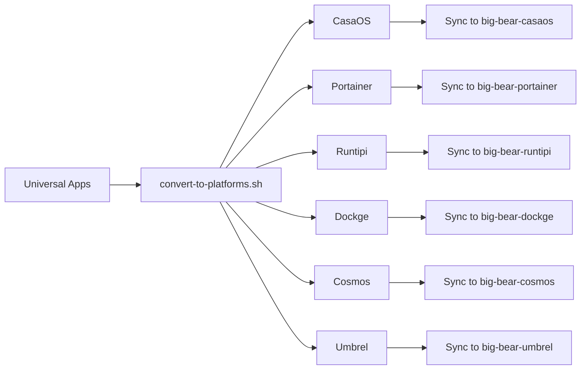

# Big Bear Universal Apps

The **Big Bear Universal Apps** repository is the **single source of truth** for all Big Bear app definitions. Apps are maintained in a universal, platform-agnostic format and automatically converted to platform-specific formats.

## 🎯 Overview

This repository serves as the central hub for Big Bear app definitions. All apps are stored in a standardized universal format and converted to various platform-specific formats:

- **CasaOS** - Home server operating system
- **Portainer** - Container management platform
- **Runtipi** - Self-hosted app platform
- **Dockge** - Docker compose management
- **Cosmos** - Reverse proxy and app platform
- **Umbrel** - Personal server OS

## 📁 Repository Structure

```
big-bear-universal-apps/
├── apps/                      # Universal app definitions (source of truth)
│   ├── jellyseerr/
│   │   ├── app.json          # App metadata and configuration
│   │   └── docker-compose.yml # Standard Docker Compose file
│   ├── plex/
│   └── ...
├── converted/                 # Platform-specific converted apps (generated)
│   ├── casaos/
│   ├── portainer/
│   ├── runtipi/
│   ├── dockge/
│   ├── cosmos/
│   └── umbrel/
├── schemas/                   # JSON schemas for validation
│   └── app-schema-v1.json
├── scripts/                   # Conversion and management scripts
│   ├── convert-to-platforms.sh
│   ├── migrate-from-casaos.sh
│   └── validate-apps.sh
├── SCHEMA.md                  # Universal format documentation
└── README.md                  # This file
```

## 🚀 Quick Start

### Adding a New App

1. **Create app directory:**
   ```bash
   mkdir -p apps/myapp
   ```

2. **Create `app.json`** with app metadata (see [SCHEMA.md](SCHEMA.md) for format)

3. **Create `docker-compose.yml`** with a clean, standard Docker Compose file

4. **Convert to all platforms:**
   ```bash
   ./scripts/convert-to-platforms.sh -a myapp
   ```

### Converting All Apps

```bash
# Convert all apps to all platforms
./scripts/convert-to-platforms.sh

# Convert to specific platforms only
./scripts/convert-to-platforms.sh -p casaos,portainer,runtipi

# Dry run (preview without making changes)
./scripts/convert-to-platforms.sh --dry-run
```

## 📝 Universal App Format

Apps in this repository use the **Universal App Format** - a comprehensive, platform-agnostic format that contains all necessary metadata and configuration.

### Key Components

1. **`app.json`** - Contains all metadata:
   - App information (name, description, version)
   - Visual assets (icons, thumbnails)
   - Technical requirements (architectures, ports)
   - Deployment configuration
   - Platform compatibility flags

2. **`docker-compose.yml`** - Standard Docker Compose file:
   - Clean, no platform-specific extensions
   - Uses relative paths (e.g., `./data`)
   - Standard Docker Compose v3+ format

See [SCHEMA.md](SCHEMA.md) for complete format documentation and examples.

## 🔄 Conversion Workflow


```mermaid
graph LR
    A[Universal Apps] --> B[convert-to-platforms.sh]
    B --> C[CasaOS]
    B --> D[Portainer]
    B --> E[Runtipi]
    B --> F[Dockge]
    B --> G[Cosmos]
    B --> H[Umbrel]
    C --> I[Sync to big-bear-casaos]
    D --> J[Sync to big-bear-portainer]
    E --> K[Sync to big-bear-runtipi]
    F --> L[Sync to big-bear-dockge]
    G --> M[Sync to big-bear-cosmos]
    H --> N[Sync to big-bear-umbrel]
```

The conversion process:
1. Read universal format from `apps/`
2. Convert to platform-specific formats
3. Output to `converted/<platform>/`
4. Sync converted apps to platform repositories
5. Create pull requests for updates

## 🛠️ Scripts

### `convert-to-platforms.sh`

Converts universal apps to all platform formats.

```bash
# Usage
./scripts/convert-to-platforms.sh [OPTIONS]

# Options
-h, --help              Show help message
-i, --input DIR         Input directory (default: ./apps)
-o, --output DIR        Output directory (default: ./converted)
-p, --platforms LIST    Comma-separated platform list
-a, --app NAME          Convert specific app only
--dry-run              Preview without changes
-v, --verbose          Verbose output

# Examples
./scripts/convert-to-platforms.sh                    # Convert all apps
./scripts/convert-to-platforms.sh -a jellyseerr      # Convert one app
./scripts/convert-to-platforms.sh -p casaos,runtipi  # Specific platforms
```

## 🧪 Validation

Validate apps against the JSON schema:

```bash
# Validate all apps
./scripts/validate-apps.sh

# Validate specific app
./scripts/validate-apps.sh -a jellyseerr
```

## 📊 Apps

| Application | Description | Docker Image | Version | Port | YouTube | Docs |
| --- | --- | --- | --- | --- | --- | --- |
| **2FAuth** | A Web app to manage your Two-Factor Authentication (2FA) accounts and generate their security codes | `2fauth/2fauth` | 8.0.2 | 8000 |  |  |
| **Actual Budget** | Actual Budget is a super fast and privacy-focused app for managing your finances. At its heart is... | `actualbudget/actual-server` | 26.9.0 | 5006 | [▶️](https://youtu.be/fa8j7ZfkYaM) |  |
| **AdGuard Home** | AdGuard Home is a network-wide software for blocking ads and tracking. After you set it up, it'll... | `adguard/adguardhome` | v0.107.79 | 8080 | [▶️](https://youtu.be/7NGnCbxBf_U) | [📖](https://github.com/AdguardTeam/AdGuardHome/wiki) |
| **AdGuard Home (HOST)** | Use if you're going to use Adguard Home as a DHCP server. AdGuard Home is a network-wide software... | `adguard/adguardhome` | v0.107.79 | 3080 |  |  |
| **Air Video HD** | Watch videos streamed instantly from your computer on your iPhone, iPad, iPod touch or Apple TV. | `dmaxwell/airvideohd` | latest | 8080 |  |  |
| **Airsonic-advanced** | Airsonic-advanced is a free, web-based media streamer, providing ubiquitious access to your music... | `linuxserver/airsonic-advanced` | 11.1.4 | 4040 |  |  |
| **Altus** | Altus is an Electron-based WhatsApp client with themes and multiple account support. | `linuxserver/altus` | 5.8.1 | 3000 |  |  |
| **Anse** | Anse is a fully optimized UI for AI Chats. Supercharged experience for multiple models such as Ch... | `ddiu8081/anse` | v1.1.11 | 8014 |  |  |
| **Ansible Semaphore** | Ansible Semaphore is a modern UI for Ansible. It lets you easily run Ansible playbooks, get notif... | `semaphoreui/semaphore` | v2.19.14 | 3000 |  |  |
| **Apprise-api** | Apprise-api Takes advantage of Apprise through your network with a user-friendly API. * Send noti... | `linuxserver/apprise-api` | 1.5.4 | 8000 |  |  |
| **Appsmith** | Low code project to build admin panels, internal tools, and dashboards, integrating 15+ databases. | `appsmith/appsmith-ce` | v2.4.1 | 1080 |  |  |
| **Archivebox** | ArchiveBox is a powerful, self-hosted internet archiving solution to collect, save, and view site... | `archivebox/archivebox` | 0.9.51 | 8002 |  |  |
| **Ardour** | Ardour is an open source, collaborative effort of a worldwide team including musicians, programme... | `linuxserver/ardour` | 0.0.0 | 3000 |  |  |
| **Arma 3 Server** | Arma 3 Dedicated Server. Updates to the latest version every time it is restarted. Supports missi... | `ghcr.io/brettmayson/arma3server/arma3server` | 1.0.0 | 2302 |  | [📖](https://community.bistudio.com/wiki/Arma_3_Dedicated_Server) |
| **Audacity** | Audacity is an easy-to-use, multi-track audio editor and recorder. Developed by a group of volunt... | `linuxserver/audacity` | 4.0.0 | 3000 |  |  |
| **Audiobookshelf** | Audiobookshelf is a self-hosted audiobook server for managing and playing your audiobooks. Audiob... | `ghcr.io/advplyr/audiobookshelf` | 2.34.0 | 8080 |  |  |
| **Authentik** | Authentik is a self-hosted identity and access management platform that provides a secure and sca... | `ghcr.io/goauthentik/server` | 2026.2.2 | 9443 |  |  |
| **Ayon** | This is the official Docker-based deployment for the Ayon Server. Ayon is a robust tool designed ... | `ynput/ayon` | 1.3.6-20240823 | 5000 |  |  |
| **Azahar** | Azahar is an open-source 3DS emulator based on Citra. | `linuxserver/azahar` | 12125.1.3 | 3000 |  |  |
| **Babybuddy** | Babybuddy is a buddy for babies! Helps caregivers track sleep, feedings, diaper changes, tummy ti... | `linuxserver/babybuddy` | 2.10.1 | 8000 |  |  |
| **Bambustudio** | Bambu Studio is an open-source, cutting-edge, feature-rich slicing software. It contains project-... | `linuxserver/bambustudio` | 02.08.03 | 3000 |  |  |
| **Baserow** | Create your own online database without technical experience. Our user-friendly no-code tool give... | `baserow/baserow` | 2.3.4 | 7350 | [▶️](https://youtu.be/Xej7sH5bNFs) |  |
| **Beaver Habit Tracker** | A self-hosted habit tracking app without Goals | `daya0576/beaverhabits` | 0.10.0 | 8080 |  |  |
| **Beets** | Beets is a music library manager and not, for the most part, a music player. It does include a si... | `linuxserver/beets` | 2.14.1 | 8337 |  |  |
| **Beszel** | A lightweight server resource monitoring hub with historical data, docker stats, and alerts. | `henrygd/beszel` | 0.20.0 | 8090 | [▶️](https://youtu.be/BUVVG-9RCbg) |  |
| **Big Bear CasaOS User Management** | Manage users in CasaOS | `bigbeartechworld/big-bear-casaos-user-management` | 0.1.1 | 5000 | [▶️](https://youtu.be/-a9k8fLAbRE) |  |
| **Bitcoin-knots** | Bitcoin Knots can be used as a desktop client for regular payments or as a full node server utili... | `linuxserver/bitcoin-knots` | 0.0.0 | 3000 |  |  |
| **Blade-of-agony** | Wolfenstein: Blade of Agony is a story-driven WWII shooter inspired by Wolfenstein and Doom. | `linuxserver/blade-of-agony` | 3.1.20260917 | 3000 |  |  |
| **Blender** | Blender is a free and open-source 3D computer graphics software toolset used for creating animate... | `linuxserver/blender` | 5.2.2 | 3000 |  |  |
| **Boinc** | BOINC is a platform for high-throughput computing on a large scale (thousands or millions of comp... | `linuxserver/boinc` | 18.04.1 | 8080 |  |  |
| **BookOrbit** | BookOrbit is a self-hosted library and reading platform for ebooks, PDFs, audiobooks, and comics.... | `ghcr.io/bookorbit/bookorbit` | 2.7.0 | 3000 |  | [📖](https://bookorbit.app/installation) |
| **Booksonic-air** | Visit homepage: https://hub.docker.com/r/linuxserver/booksonic-air/ | `linuxserver/booksonic-air` | 2201.1.0 | 4040 |  |  |
| **bookstack** | BookStack is a simple, self-hosted, easy-to-use platform for organising and storing information. ... | `linuxserver/bookstack` | 26.05.20260608 | 8080 | [▶️](https://youtu.be/_jW4RjJm-6A) |  |
| **Brave** | This Image contains a browser-accessible version of Brave. | `kasmweb/brave` | 1.15.0-rolling | 6901 | [▶️](https://youtu.be/CJ2x-yCW-co) |  |
| **btop** | A monitor of resources. Software made by Aristocratos at https://github.com/aristocratos/btop | `bigbeartechworld/big-bear-btop` | 0.1.11 | 7681 | [▶️](https://youtu.be/mD52bujMt68) |  |
| **Budge** | Budge is an open source 'budgeting with envelopes' personal finance app. | `linuxserver/budge` | 0.0.9 | 80 |  |  |
| **Budibase** | Low code platform for creating internal tools, workflows, and admin panels in minutes. Supports P... | `budibase/budibase` | v3.46.0 | 8080 |  |  |
| **Build-agent** | This container needs special attention. Please check https://hub.docker.com/r/linuxserver/build-a... | `linuxserver/build-agent` | 0.0.0 | 80 |  |  |
| **Buzz** | Buzz is a self-hostable workspace for humans and agents from Block. It runs a Nostr relay, a REST... | `ghcr.io/block/buzz` | latest | 3000 |  | [📖](https://engineering.block.xyz/blog/run-your-own-buzz-relay) |
| **Caddy** | Caddy - The Ultimate Server with Automatic HTTPS. | `caddy` | 2.11.4 | 48100 |  |  |
| **cAdvisor** | cAdvisor (Container Advisor) provides container users an understanding of the resource usage and ... | `gcr.io/cadvisor/cadvisor` | v0.55.1 | 8085 |  |  |
| **Cal.com** | The open source Calendly successor. You are in charge of your own data, workflow, and appearance.... | `calcom/cal.com` | v6.2.0 | 3000 |  |  |
| **Calibre** | Calibre is a powerful and easy to use e-book manager. Users say it's outstanding and a must-have.... | `linuxserver/calibre` | 9.15.0 | 8080 |  |  |
| **Calibre-web** | Calibre-web is a web app providing a clean interface for browsing, reading and downloading eBooks... | `linuxserver/calibre-web` | 0.6.27 | 8083 |  |  |
| **Calligra** | Calligra is an office and graphic art suite by KDE. It is available for desktop PCs, tablet compu... | `linuxserver/calligra` | 3.2.1 | 3000 |  |  |
| **CasaOS Toolbox** | CasaOS Toolbox is an extension application that provides additional features to CasaOS. | `wisdomsky/casaos-toolbox` | 0.2 | 8088 |  |  |
| **Celestory & Voltask** | The all-in-one no-code platform for interactive storytelling and Voltask automation engine. Paid ... | `celestory/gateway` | 1.1.2 | 1500 |  |  |
| **Change Detection** | The best and simplest free open source website change detection, restock monitor and notification... | `ghcr.io/dgtlmoon/changedetection.io` | 0.55.3 | 5000 |  |  |
| **Changedetection.io** | Changedetection.io provides free, open-source web page monitoring, notification and change detect... | `linuxserver/changedetection.io` | 0.60.6 | 5000 |  |  |
| **Chatpad** | Recently, there has been a surge of UIs for ChatGPT, making it the new to-do app that everyone wa... | `ghcr.io/deiucanta/chatpad` | f45cd53bc410412610c1ba1cbd84cd137d8e167d | 8080 |  |  |
| **chrome** | This Image contains a browser-accessible version of chrome. | `kasmweb/chrome` | 1.15.0-rolling | 6902 | [▶️](https://youtu.be/jYm_Ih8VHAs) |  |
| **chromium** | This Image contains a browser-accessible version of chromium. | `linuxserver/chromium` | version-6ae43f81 | 3000 | [▶️](https://youtu.be/ziy4c4n7KnU) |  |
| **Ci** | This container needs special attention. Please check https://hub.docker.com/r/linuxserver/ci for ... | `linuxserver/ci` | 0.0.0 | 80 |  |  |
| **Ci-debug** | This container needs special attention. Please check https://hub.docker.com/r/linuxserver/ci-debu... | `linuxserver/ci-debug` | 0.0.0 | 80 |  |  |
| **Citron** | Citron is a feature rich Switch 1 emulator for homebrew. | `linuxserver/citron` | 2026.02.1 | 3000 |  |  |
| **Cloudflared Web** | Cloudflared-web is a docker image that packages both cloudflared cli and a simple Web UI to easil... | `wisdomsky/cloudflared-web` | 2026.9.1 | 14333 | [▶️](https://youtu.be/JvyyolXJ0-A) | [📖](https://github.com/wisdomsky/cloudflared-web) |
| **Code Server** | Run VS Code on any machine anywhere and access it in the browser. | `linuxserver/code-server` | 4.138.0 | 8080 | [▶️](https://youtu.be/aiYcwXDfgE8) |  |
| **CodeX Docs** | CodeX Docs is a free docs application. It's based on Editor.js ecosystem which gives all modern o... | `ghcr.io/codex-team/codex.docs` | v2.2 | 3000 | [▶️](https://youtu.be/dKm2VJwam24) |  |
| **Compose Toolbox** | Self-hosted tool to edit, validate, and get suggestions for docker-compose.yml files. | `ghcr.io/bluegoosemedia/composetoolbox` | latest | 3002 |  | [📖](https://github.com/bluegoosemedia/composetoolbox) |
| **ConvertX** | A self-hosted online file converter. Supports over a thousand different formats. Written with Typ... | `ghcr.io/c4illin/convertx` | v0.17.0 | 3000 |  |  |
| **Coolify** | Coolify is a self-hosted web application that allows you to manage your servers, applications, an... | `ghcr.io/coollabsio/coolify` | 4.0.0-beta.434 | 8000 | [▶️](https://youtu.be/IZ-vOuMR4Kc) |  |
| **Cops** | Cops by Sébastien Lucas, now maintained by MikesPub, stands for Calibre OPDS (and HTML) Php Serve... | `linuxserver/cops` | 4.5.4 | 80 |  |  |
| **Crafty Controller** | Crafty 4 is the next iteration of our Minecraft Server Wrapper / Controller / Launcher. | `registry.gitlab.com/crafty-controller/crafty-4` | 4.10.4 | 8443 | [▶️](https://youtu.be/Vw4su8hT_7A) |  |
| **Cura** | UltiMaker Cura is free, easy-to-use 3D printing software trusted by millions of users. Fine-tune ... | `linuxserver/cura` | 5.13.0 | 3000 |  |  |
| **CyberChef** | CyberChef is a simple, intuitive web app for carrying out all manner of cyber operations within a... | `ghcr.io/gchq/cyberchef` | 11.0.0 | 8080 |  |  |
| **D2-builder** | This container needs special attention. Please check https://hub.docker.com/r/linuxserver/d2-buil... | `linuxserver/d2-builder` | 0.9.0 | 80 |  |  |
| **Daapd** | Visit homepage: https://hub.docker.com/r/linuxserver/daapd/ | `linuxserver/daapd` | 28.10.20250118 | 80 |  |  |
| **Darktable** | darktable is an open source photography workflow application and raw developer. A virtual lightta... | `linuxserver/darktable` | 25.6.1 | 3000 |  |  |
| **Dashdot** | About A simple, modern server dashboard, primarily used by smaller private servers. | `mauricenino/dashdot` | 6.3.4 | 3001 | [▶️](https://youtu.be/if_fyuX_5fU) |  |
| **Dashy (Legacy)** | Dashy helps you organize your self-hosted services by making them accessible from a single place | `lissy93/dashy` | 3.3.1 | 4000 |  |  |
| **Dashy v4** | Dashy helps you organize your self-hosted services by making them accessible from a single place | `lissy93/dashy` | 4.0.8 | 4001 |  | [📖](https://github.com/Lissy93/dashy/blob/master/docs/changelog.md) |
| **Davis** | A simple, fully translatable admin interface for sabre/dav based on Symfony 5 and Bootstrap 5, in... | `ghcr.io/tchapi/davis-standalone` | 5.4.1 | 9000 |  |  |
| **DBGate** | Web based UI for managing and exploring SQL database data | `dbgate/dbgate` | 7.3.0-alpine | 3000 |  |  |
| **Ddclient** | Ddclient is a Perl client used to update dynamic DNS entries for accounts on Dynamic DNS Network ... | `linuxserver/ddclient` | 4.0.0 | 80 |  |  |
| **Digikam** | digiKam: Professional Photo Management with the Power of Open Source | `linuxserver/digikam` | 9.1.0 | 3000 |  |  |
| **Dillinger** | Visit homepage: https://hub.docker.com/r/linuxserver/dillinger/ | `linuxserver/dillinger` | 3.39.1 | 8080 |  |  |
| **DiscoPanel** | DiscoPanel is a game server panel for Minecraft. It provides a clean interface for creating and m... | `nickheyer/discopanel` | v2.0.15 | 8080 |  | [📖](https://docs.discopanel.app) |
| **Diskover** | Diskover is an open source file system indexer that uses Elasticsearch to index and manage data a... | `linuxserver/diskover` | 2.3.5 | 80 |  |  |
| **DIUN** | Docker Image Update Notifier is a CLI application written in Go and delivered as a single executa... | `crazymax/diun` | 4.33.0 | N/A |  |  |
| **Docker Cron Restart Notifier** | This Docker image is designed to automatically restart specified Docker containers and send notif... | `deduard/tools` | restart-notifier-latest | N/A |  |  |
| **Dockge** | A fancy, easy-to-use and reactive docker `compose.yaml` stack-oriented manager | `louislam/dockge` | 1.5.0 | 5001 | [▶️](https://youtu.be/8Z6psh-t5iU) |  |
| **Dockhand** | Modern, efficient Docker management application providing real-time container management, Compose... | `fnsys/dockhand` | latest | 3003 |  | [📖](https://dockhand.pro/manual/) |
| **Dockpeek** | A lightweight, self-hosted Docker dashboard that provides quick access to all running containers ... | `ghcr.io/dockpeek/dockpeek` | v1.7.2 | 3420 |  |  |
| **Docmost** | Docmost is an open-source alternative to the likes of Notion and Confluence. Whether you're manag... | `docmost/docmost` | 0.96.0 | 3000 |  |  |
| **Dogwalk** | DOGWALK is Blender Studio's long awaited second game project, focused on creating a bite-sized in... | `linuxserver/dogwalk` | 0.0.0 | 3000 |  |  |
| **Dokuwiki** | Dokuwiki is a simple to use and highly versatile Open Source wiki software that doesn't require a... | `linuxserver/dokuwiki` | 0.0.0 | 80 |  |  |
| **Dolphin** | Dolphin Emulator lets you play GameCube and Wii games with various graphical enhancements and oth... | `linuxserver/dolphin` | 0.0.0 | 3000 |  |  |
| **Domain Locker** | 🌐 The all-in-one tool, for keeping track of your domain name portfolio. Got domain names? Get Do... | `ghcr.io/lissy93/domain-locker` | 0.2.4 | 8180 |  | [📖](https://github.com/Lissy93/domain-locker) |
| **Domoticz** | Visit homepage: https://hub.docker.com/r/linuxserver/domoticz/ | `linuxserver/domoticz` | 2023.2.20231129 | 8080 |  |  |
| **Dosbox-staging** | DOSBox Staging is a modern continuation of DOSBox a free and open-source emulator that enables th... | `linuxserver/dosbox-staging` | 0.83.0 | 3000 |  |  |
| **Doublecommander** | Double Commander is a free cross platform open source file manager with two panels side by side. ... | `linuxserver/doublecommander` | 0.0.0 | 3000 |  |  |
| **Dozzle** | Dozzle is a real-time log viewer for docker containers. | `amir20/dozzle` | v11.1.1 | 8888 | [▶️](https://youtu.be/lLLNDcHNOuM) |  |
| **Draw.io** | Draw.io is a structured diagram editor for creating flowcharts, network diagrams, and other visua... | `jgraph/drawio` | 31.4.6 | 8080 |  | [📖](https://www.drawio.com/doc/) |
| **Duckdns** | Duckdns is a free service which will point a DNS (sub domains of duckdns.org) to an IP of your ch... | `linuxserver/duckdns` | 0.0.0 | 80 |  |  |
| **Duckstation** | DuckStation is a PS1 Emulator aiming for the best accuracy and game support. | `linuxserver/duckstation` | 0.0.0 | 3000 |  |  |
| **Duplicati** | Duplicati is a backup client that securely stores encrypted, incremental, compressed backups on l... | `linuxserver/duplicati` | 2.4.0 | 8200 |  |  |
| **Eclipse Mosquitto** | Eclipse Mosquitto is an open source implementation of a server for versions 5, 3.1.1, and 3.1 of ... | `eclipse-mosquitto` | 2 | 1883 |  |  |
| **Eden** | Eden is an experimental open-source emulator for the Nintendo Switch, built with performance and ... | `linuxserver/eden` | 0.2.1 | 3000 |  |  |
| **EJBCA Community** | The open-source public key infrastructure (PKI) and certificate authority (CA) software EJBCA is ... | `keyfactor/ejbca-ce` | 9.6.3 | 8443 |  | [📖](https://doc.primekey.com/ejbca/ejbca-introduction) |
| **Emby** | Emby organizes video, music, live TV, and photos from personal media libraries and streams them t... | `linuxserver/emby` | 4.10.0 | 8096 |  |  |
| **Embystat** | Visit homepage: https://hub.docker.com/r/linuxserver/embystat/ | `linuxserver/embystat` | 0.2.0 | 6555 |  |  |
| **Emulatorjs** | Emulatorjs - In browser web based emulation portable to nearly any device for many retro consoles... | `linuxserver/emulatorjs` | 1.9.2 | 3000 |  |  |
| **Endlessh** | Visit homepage: https://github.com/orgs/linuxserver/packages/container/package/endlessh | `linuxserver/endlessh` | 0.0.0 | 22 |  |  |
| **Ente Photos** | Ente is a self-hosted, end-to-end encrypted platform to store, share, and rediscover your photos ... | `ghcr.io/ente/web` | latest | 3000 |  | [📖](https://help.ente.io/self-hosting/) |
| **Erugo** | A powerful, self-hosted file-sharing platform built with PHP and Laravel with a Vue.js frontend. ... | `wardy784/erugo` | 0.2.15 | 9997 |  |  |
| **ESPHome** | ESPHome is a system to control your microcontrollers by simple yet powerful configuration files a... | `esphome/esphome` | 2026.9 | 6052 |  |  |
| **Eufy Security WS** | eufy-security-ws is a small server wrapper around the eufy-security-client library to access it v... | `bropat/eufy-security-ws` | 3.1.0 | 3000 |  |  |
| **Excalidraw** | Virtual whiteboard for sketching hand-drawn like diagrams | `excalidraw/excalidraw` | latest | 8000 | [▶️](https://youtu.be/T4K6RDhieIA) |  |
| **Fail2ban** | Fail2ban is a daemon to ban hosts that cause multiple authentication errors. | `linuxserver/fail2ban` | 1.1.0 | 80 |  |  |
| **FarmOS (Legacy)** | farmOS is a web-based application for farm management, planning, and record keeping. It is develo... | `farmos/farmos` | 3.5.1 | 8080 |  |  |
| **FarmOS v4** | farmOS is a web-based application for farm management, planning, and record keeping. It is develo... | `farmos/farmos` | 4.0.6 | 8083 |  | [📖](https://farmos.org/hosting/install/) |
| **Faster-whisper** | Faster-whisper is a reimplementation of OpenAI's Whisper model using CTranslate2, which is a fast... | `linuxserver/faster-whisper` | 3.8.1 | 7575 |  |  |
| **Fastfetch** | Fastfetch is a neofetch-like tool for fetching system information and displaying it prettily. It ... | `bigbeartechworld/big-bear-fastfetch` | 0.0.5 | 7681 | [▶️](https://youtu.be/pVBMvIMzfpw) |  |
| **Feed2toot** | Feed2toot automatically parses rss feeds, identifies new posts and posts them on the Mastodon soc... | `linuxserver/feed2toot` | 0.17.20251115 | 8080 |  |  |
| **Ferdium** | Ferdium is a desktop app that helps you organize how you use your favourite apps by combining the... | `linuxserver/ferdium` | 7.2.3 | 3000 |  |  |
| **Ffmpeg** | This container needs special attention. Please check https://hub.docker.com/r/linuxserver/ffmpeg ... | `linuxserver/ffmpeg` | 8.1.2 | 80 |  |  |
| **Filebrowser** | Reliable and Performant File Management Desktop Sync and File Sharing Tool. | `filebrowser/filebrowser` | v2.63.23-s6 | 8080 |  |  |
| **FileBrowser Quantum** | A self-hosted web file manager forked from FileBrowser with advanced features including OIDC auth... | `gtstef/filebrowser` | 1.5.6-stable | 8700 |  |  |
| **Filezilla** | FIleZilla Client is a fast and reliable cross-platform FTP, FTPS and SFTP client with lots of use... | `linuxserver/filezilla` | 3.69.6 | 3000 |  |  |
| **Financial Freedom** | Keep investors and their buyers out of your financial data. Own 100% of your data and start build... | `serversideup/financial-freedom` | v0.2.0-alpha1 | 8443 |  |  |
| **Firefox** | This Image contains a browser-accessible version of Firefox. | `linuxserver/firefox` | 1155.0.1 | 3000 | [▶️](https://youtu.be/RPBshN5hGWQ) |  |
| **Fireshare** | Fireshare lets you host your own video and image content and share it with others via public or p... | `shaneisrael/fireshare` | 1.8.1 | 8585 |  | [📖](https://github.com/ShaneIsrael/fireshare#readme) |
| **Flame** | Flame is a self-hosted startpage for your server. Its design is heavily inspired by SUI. Flame is... | `pawelmalak/flame` | multiarch2.3.1 | 5005 | [▶️](https://youtu.be/p_P_jKmJRz8) |  |
| **FlContainers Guacamole** | A Docker Container for Apache Guacamole, a client-less remote desktop gateway. It supports standa... | `flcontainers/guacamole` | 1.6.0 | 8080 |  |  |
| **Fleet** | Fleet provides an online web interface which displays a set of maintained images from one or more... | `linuxserver/fleet` | 2.3.3 | 8080 |  |  |
| **Flowise AI** | Flowise AI is an Open source UI visual tool to build your customized LLM orchestration flow & AI ... | `flowiseai/flowise` | 3.1.4 | 8009 |  |  |
| **Flycast** | Flycast is a multi-platform Sega Dreamcast, Naomi, Naomi 2, and Atomiswave emulator derived from ... | `linuxserver/flycast` | 2.7.20260913 | 3000 |  |  |
| **Focalboard** | Focalboard is an open source, multilingual, self-hosted project management tool that's an alterna... | `mattermost/focalboard` | 7.11.4 | 8000 | [▶️](https://youtu.be/fBDpqpN8sks) |  |
| **Foldingathome** | Folding@home is a distributed computing project for simulating protein dynamics, including the pr... | `linuxserver/foldingathome` | 8.5.6 | 80 |  |  |
| **Freecad** | FreeCAD is a general-purpose parametric 3D computer-aided design (CAD) modeler and a building inf... | `linuxserver/freecad` | 1.1.3 | 3000 |  |  |
| **Freshrss** | Freshrss is a free, self-hostable aggregator for rss feeds. | `linuxserver/freshrss` | 1.30.0 | 80 |  |  |
| **GemDigest Bot** | Simplify your reads, amplify your time! 📚✨ GemDigest is a Telegram bot that summarizes articles ... | `piero24/gemdigest` | 1.0 | 3333 |  |  |
| **Genmon** | Generac (and other models) Generator Monitoring using a Raspberry Pi and WiFi | `bigbeartechworld/big-bear-genmon` | 2.0.01 | 8000 | [▶️](https://youtu.be/b0_zuVVeIP4) |  |
| **Ghost** | Ghost is a free and open source blogging platform written in JavaScript and distributed under the... | `ghost` | 6.63.0-alpine | 2368 | [▶️](https://youtu.be/oJZK9vH4W4Y) |  |
| **Ghostfolio** | Open Source Wealth Management Software. Angular + NestJS + Prisma + Nx + TypeScript 🤍 | `ghostfolio/ghostfolio` | 3.72.0 | 3333 | [▶️](https://youtu.be/CNe4-8Vyhos) |  |
| **Gimp** | GIMP is a free and open-source raster graphics editor used for image manipulation (retouching) an... | `linuxserver/gimp` | 0.0.0 | 3000 |  |  |
| **Gitea** | Gitea is a painless self-hosted all-in-one software development service. It includes Git hosting,... | `gitea/gitea` | 1.27.3 | 3000 |  | [📖](https://docs.gitea.com/) |
| **Gitea Mirror** | Gitea Mirror is a modern web app for automatically mirroring repositories from GitHub to your sel... | `ghcr.io/raylabshq/gitea-mirror` | v3.15.10 | 4321 |  | [📖](https://community.bigbeartechworld.com/t/added-gitea-mirror-to-bigbearcasaos/3515?u=dragonfire1119#p-5962-documentation-6) |
| **Github-desktop** | Github Desktop is an open source Electron-based GitHub app. It is written in TypeScript and uses ... | `linuxserver/github-desktop` | 3.4.13 | 3000 |  |  |
| **Gitqlient** | GitQlient is a multi-platform Git client originally forked from QGit. Nowadays it goes beyond of ... | `linuxserver/gitqlient` | 1.6.3 | 3000 |  |  |
| **Gladys Assistant** | Gladys Assistant is a modern, privacy-first & open-source home automation software that runs anyw... | `gladysassistant/gladys` | v5.1.1 | 1080 | [▶️](https://youtu.be/l4GPomJMIT0) |  |
| **Glance** | Glance is a self-hosted dashboard that puts all your feeds in one place. | `glanceapp/glance` | v0.8.6 | 8280 |  | [📖](https://github.com/glanceapp/glance/blob/main/docs/configuration.md) |
| **Glances** | Glances is an open-source system cross-platform monitoring tool. It allows real-time monitoring o... | `nicolargo/glances` | 4.5.3.2-full | 61208 | [▶️](https://youtu.be/nwsVJ0QB0sM) |  |
| **Gluetun** | Lightweight swiss-knife-like VPN client to multiple VPN service providers | `qmcgaw/gluetun` | v3.41.3 | N/A |  | [📖](https://community.bigbeartechworld.com/t/added-gluetun-to-big-bear-casaos/175) |
| **GoAway** | GoAway is a lightweight DNS sinkhole that blocks ads, trackers, and malicious domains at the netw... | `pommee/goaway` | 0.63.17 | 8080 |  | [📖](https://community.bigbeartechworld.com/t/added-goaway-to-bigbearcasaos/4085) |
| **Gotify** | a simple server for sending and receiving messages | `gotify/server` | 3.1.1 | 8091 |  |  |
| **Grav** | Grav is a Fast, Simple, and Flexible, file-based Web-platform. | `linuxserver/grav` | 2.1.10 | 80 |  |  |
| **Grocy** | Grocy is an ERP system for your kitchen! Cut down on food waste, and manage your chores with this... | `linuxserver/grocy` | 4.7.1 | 9283 |  |  |
| **Guacamole** | Apache Guacamole is a free and open-source, cross-platform, clientless remote desktop gateway mai... | `guacamole/guacamole` | 1.6.0 | 8090 | [▶️](https://youtu.be/6cu0kfP50Jg) |  |
| **Gzdoom** | GZDoom is a feature centric port for all Doom engine games, based on ZDoom, adding an OpenGL rend... | `linuxserver/gzdoom` | 4.14.2 | 3000 |  |  |
| **Habridge** | Habridge emulates Philips Hue API to other home automation gateways such as an Amazon Echo/Dot Ge... | `linuxserver/habridge` | 5.4.1 | 8080 |  |  |
| **Handbrake** | HandBrake is an open-source tool, built by volunteers, for converting video from nearly any forma... | `linuxserver/handbrake` | 1.11.2 | 3000 |  |  |
| **Healthchecks** | Healthchecks is a watchdog for your cron jobs. It's a web server that listens for pings from your... | `linuxserver/healthchecks` | 4.4.20260921 | 8000 |  |  |
| **Hedgedoc** | HedgeDoc gives you access to all your files wherever you are. HedgeDoc is a real-time, multi-plat... | `linuxserver/hedgedoc` | 1.12.0 | 3000 |  |  |
| **Heimdall** | Heimdall is a way to organise all those links to your most used web sites and web applications in... | `linuxserver/heimdall` | 2.8.3 | 80 |  |  |
| **Helium** | Helium is a Chromium-based web browser made for people, with love. Privacy-first with unbiased ad... | `linuxserver/helium` | 0.17.1 | 3000 |  |  |
| **Hermes Agent** | Hermes Agent 0.21.3 is a self-hosted AI agent with a gateway API and an authenticated web dashboard. | `nousresearch/hermes-agent` | v2026.9.21 | 9119 |  | [📖](https://hermes-agent.nousresearch.com/docs/) |
| **Hestia CP** | Hestia Control Panel (HestiaCP) is an open-source web hosting control panel that allows users to ... | `artsemkniazeu/hestiacp` | latest | 48112 |  |  |
| **Hishtory-server** | hiSHtory is a better shell history. It stores your shell history in context (what directory you r... | `linuxserver/hishtory-server` | 0.335.20260911 | 8080 |  |  |
| **Homarr** | Simplify the management of your server with Homarr - a sleek, modern dashboard that puts all of y... | `ghcr.io/ajnart/homarr` | 0.16.1 | 7575 | [▶️](https://youtu.be/H4rzZNO47Uk) |  |
| **Homarr v1** | Homarr v1 - A sleek, modern dashboard for your server. This is the latest major version (v1.x) fr... | `ghcr.io/homarr-labs/homarr` | v1.63.0 | 7575 |  | [📖](https://homarr.dev/docs) |
| **Home Assistant** | Open source home automation that puts local control and privacy first. Powered by a worldwide com... | `ghcr.io/home-assistant/home-assistant` | 2026.5.1 | 8123 | [▶️](https://youtu.be/YnCpj5sND_A) |  |
| **HomeBridge** | HomeKit support for the impatient. | `homebridge/homebridge` | 2024-05-02 | 8581 |  |  |
| **Homepage** | A modern, fully static, fast, secure fully proxied, highly customizable application dashboard wit... | `ghcr.io/gethomepage/homepage` | v2.4.0 | 3000 |  |  |
| **Homer** | A dead simple static HOMepage for your servER to keep your services on hand, from a simple yaml c... | `b4bz/homer` | v26.08.3 | 8080 |  |  |
| **HRConvert2** | HRConvert2 is a self-hosted drag-and-drop file conversion server & file sharing tool that support... | `dwaaan/hrconvert2-docker` | latest | 48113 |  |  |
| **I Hate Money** | I hate money is a web application made to ease shared budget management. It keeps track of who bo... | `ihatemoney/ihatemoney` | 7.2.1 | 8001 | [▶️](https://youtu.be/aHz0Vh-KbXw) |  |
| **Immich** | Self-hosted photo and video storage. | `ghcr.io/immich-app/immich-server` | v3.1.0 | 2283 | [▶️](https://youtu.be/ZIx2jDHYjjE) |  |
| **Immich AIO Alpine** | AIO Alpine. Self-hosted photo and video storage. | `ghcr.io/imagegenius/immich` | 3.2.2 | 2283 |  |  |
| **Immich Kiosk** | Immich Kiosk is a lightweight slideshow for running on kiosk devices and browsers that uses Immic... | `ghcr.io/damongolding/immich-kiosk` | 0.38.1 | 3000 |  |  |
| **Immich without machine learning** | Self-hosted photo and video storage. This does not include the machine learning part. | `ghcr.io/immich-app/immich-server` | v3.1.0 | 2283 | [▶️](https://youtu.be/ZIx2jDHYjjE) |  |
| **Inkscape** | Inkscape is professional quality vector graphics software which runs on Linux, Mac OS X and Windo... | `linuxserver/inkscape` | 1.4.2 | 3000 |  |  |
| **Intellij-idea** | IntelliJ IDEA helps you write code faster with tools that eliminate tedious tasks and let you foc... | `linuxserver/intellij-idea` | 42026.2.3 | 3000 |  |  |
| **Invoice Ninja** | Invoice Ninja is a free and open-source invoice and expense management system. It is a web-based ... | `invoiceninja/invoiceninja` | 5.13.43 | 8080 |  |  |
| **IT Tools** | Collection of handy online tools for developers, with great UX as a web app. | `corentinth/it-tools` | 2023.11.2-7d94e11 | 8080 | [▶️](https://youtu.be/MlGypCrUJug) |  |
| **Jellyfin** | Jellyfin is a Free Software Media System that puts you in control of managing and streaming your ... | `linuxserver/jellyfin` | 0.0.0 | 8096 |  |  |
| **Jellyseerr (Legacy)** | Jellyseerr is a free and open source software application for managing requests for your media li... | `fallenbagel/jellyseerr` | 2.7.3 | 5055 |  |  |
| **Jellystat** | Jellystat is a free and open source Statistics App for Jellyfin! (This project is still in develo... | `cyfershepard/jellystat` | 1.1.12 | 3000 |  |  |
| **Jenkins-builder** | This container needs special attention. Please check https://hub.docker.com/r/linuxserver/jenkins... | `linuxserver/jenkins-builder` | 0.0.0 | 80 |  |  |
| **jfa-go** | jfa-go is a user management app for Jellyfin (and Emby as 2nd class) that provides invite-based a... | `hrfee/jfa-go` | latest | 8056 |  |  |
| **Jlesage Firefox** | The GUI of the application is accessed through a modern web browser (no installation or configura... | `jlesage/firefox` | v26.09.1 | 5800 | [▶️](https://youtu.be/JWhR8RKGh9Y) | [📖](https://community.bigbeartechworld.com/t/added-jlesage-firefox-to-bigbearcasaos/2506#p-4575-documentation-4) |
| **Jlesage Handbrake** | The GUI of the application is accessed through a modern web browser (no installation or configura... | `jlesage/handbrake` | v26.09.1 | 5800 |  |  |
| **Joomla** | Another free and open-source CMS | `joomla` | 6.1.3-apache | 48105 |  |  |
| **joplin** | Note taking and to-do application with synchronisation | `joplin/server` | 3.7.2 | 22300 | [▶️](https://youtu.be/FjVyg0X-_zc) |  |
| **Kali-linux** | Kali-linux - is an Advanced Penetration Testing Linux distribution used for Penetration Testing, ... | `linuxserver/kali-linux` | 0.0.0 | 3000 |  |  |
| **Kasm** | The Container Streaming Platform - Streaming containerized apps and desktops to end-users. The Wo... | `linuxserver/kasm` | 1.120.20221218 | 3000 | [▶️](https://youtu.be/Fq7PlvRSvT4) |  |
| **Kavita** | Kavita is a fast, feature rich, cross platform reading server | `jvmilazz0/kavita` | 0.9.1 | 5000 |  |  |
| **Kdenlive** | Kdenlive is a powerful free and open source cross-platform video editing program made by the KDE ... | `linuxserver/kdenlive` | 423.08.5 | 3000 |  |  |
| **Keepassxc** | KeePassXC is a free and open-source password manager. It started as a community fork of KeePassX ... | `linuxserver/keepassxc` | 2.7.12 | 3000 |  |  |
| **Kicad** | KiCad - A Cross Platform and Open Source Electronics Design Automation Suite. | `linuxserver/kicad` | 10.0.3 | 3000 |  |  |
| **Kimai** | Kimai is a professional grade time-tracking application, free and open-source. It handles use-cas... | `linuxserver/kimai` | 2.67.0 | 80 |  |  |
| **KitchenOwl** | KitchenOwl is a self-hosted grocery list and recipe manager. Track what you need to buy, add reci... | `tombursch/kitchenowl` | v0.7.10 | 9287 |  | [📖](https://docs.kitchenowl.org/) |
| **Kiwix Server** | Kiwix Server is a web server for hosting .zim files | `ghcr.io/kiwix/kiwix-serve` | 3.7.0-2 | 8080 |  |  |
| **Kometa** | Kometa is a powerful tool designed to give you complete control over your media libraries. With K... | `linuxserver/kometa` | 2.4.8 | 80 |  |  |
| **Komf** | Komga and Kavita Metadata Fetcher is a tool that fetches metadata and thumbnails for your digital... | `sndxr/komf` | 2.0.1 | 8085 |  |  |
| **Komga** | A media server for your comics, mangas, BDs, magazines and eBooks. | `ghcr.io/gotson/komga` | 1.24.4 | 25600 |  |  |
| **Kopia** | Kopia is a fast and secure open-source backup/restore tool that allows you to create encrypted sn... | `ghcr.io/thespad/kopia-server` | v0.17.0-spad3 | 51515 |  |  |
| **Krita** | Krita is a professional FREE and open source painting program. It is made by artists that want to... | `linuxserver/krita` | 5.3.4 | 3000 |  |  |
| **LAN Cache** | Make the most of your network. Get more play for your gamers. Download your games once and serve ... | `lancachenet/monolithic` | latest | 8080 |  |  |
| **Ldap-auth** | Ldap-auth software is for authenticating users who request protected resources from servers proxi... | `linuxserver/ldap-auth` | 3.4.8 | 8888 |  |  |
| **Libredesk** | Open source, self-hosted customer support desk. Single binary app. | `libredesk/libredesk` | v0.7.4-alpha | 9000 |  |  |
| **Libreoffice** | LibreOffice is a free and powerful office suite, and a successor to OpenOffice.org (commonly know... | `linuxserver/libreoffice` | 25.8.7 | 3000 |  |  |
| **Librespeed** | Librespeed is a very lightweight Speedtest implemented in Javascript, using XMLHttpRequest and We... | `linuxserver/librespeed` | 6.3.0 | 80 |  |  |
| **LibreTranslate** | Free and Open Source Machine Translation API, entirely self-hosted. Unlike other APIs, it doesn't... | `libretranslate/libretranslate` | v1.9.6 | 5000 | [▶️](https://youtu.be/VJ5DrsuJ3oA) |  |
| **Librewolf** | LibreWolf is a custom and independent version of Firefox, with the primary goals of privacy, secu... | `linuxserver/librewolf` | 155.0.1 | 3000 |  |  |
| **Limnoria** | Limnoria A robust, full-featured, and user/programmer-friendly Python IRC bot, with many existing... | `linuxserver/limnoria` | 2026.5.8 | 8080 |  |  |
| **LinkStack** | LinkStack is a link-in-bio tool that allows you to create a personalized and easily customizable ... | `linkstackorg/linkstack` | V4 | 10443 | [▶️](https://youtu.be/1KgFlCsItro) |  |
| **Linkwarden** | ⚡️⚡️⚡️Self-hosted collaborative bookmark manager to collect, organize, and preserve webpages and ... | `ghcr.io/linkwarden/linkwarden` | v2.14.1 | 3000 | [▶️](https://youtu.be/KZXZAi9Vjs4) |  |
| **Lm-studio** | LM Studio can run local AI models like gpt-oss, Llama, Gemma, Qwen, and DeepSeek privately on you... | `linuxserver/lm-studio` | 0.0.0 | 3000 |  |  |
| **LobeChat** | LobeChat is a open-source, extensible (Function Calling), high-performance chatbot framework. It ... | `lobehub/lobe-chat` | 1.143.3 | 3210 |  |  |
| **Lollypop** | Lollypop is a lightweight modern music player designed to work excellently on the GNOME desktop e... | `linuxserver/lollypop` | 1.4.45 | 3000 |  |  |
| **LS Adguard Home Sync** | 🛡️ Synchronize AdGuard Home config to replicas. This is the LinuxServer version. | `linuxserver/adguardhome-sync` | 0.9.3 | 8080 |  |  |
| **Lsio-api** | This container needs special attention. Please check https://hub.docker.com/r/linuxserver/lsio-ap... | `linuxserver/lsio-api` | 0.0.0 | 80 |  |  |
| **Luanti** | Luanti (formerly Minetest) is an open source voxel game-creation platform with easy modding and g... | `linuxserver/luanti` | 5.17.0 | 30000 |  |  |
| **Lychee** | Lychee is a free photo-management tool, which runs on your server or web-space. Installing is a m... | `linuxserver/lychee` | 7.8.4 | 80 |  |  |
| **LyriOn Music Server** | Simplify the management of your server with Homarr - a sleek, modern dashboard that puts all of y... | `lmscommunity/lyrionmusicserver` | 9.2.0 | 9000 |  |  |
| **Mailpit** | Mailpit is a multi-platform email testing tool & API for developers. | `axllent/mailpit` | v1.31 | 8025 | [▶️](https://youtu.be/2MY3S6csrVw) |  |
| **Mame** | MAME is a free and open-source emulator designed to emulate the hardware of arcade games, video g... | `linuxserver/mame` | 0.0.0 | 3000 |  |  |
| **Manyfold** | Manyfold is an open source, self-hosted web application for managing a collection of 3D models, p... | `linuxserver/manyfold` | 0.149.0 | 3214 |  |  |
| **Mariadb** | Mariadb is one of the most popular database servers. Made by the original developers of MySQL. | `linuxserver/mariadb` | 11.8.8 | 3306 |  |  |
| **Mastodon** | Mastodon is a free, open-source social network server based on ActivityPub where users can follow... | `linuxserver/mastodon` | 4.7.2 | 80 |  |  |
| **Matterbridge** | Matterbridge is a Matter plugin manager that allows you to have all your Matter devices up and ru... | `luligu/matterbridge` | 3.10.10 | 8283 |  |  |
| **Maybe Finance** | Maybe is a fully* open-source OS for your personal finances built by a small team alongside an in... | `ghcr.io/maybe-finance/maybe` | sha-347c0a790693031fdd3b32792b5b6792693d1805 | 4000 |  |  |
| **Mealie** | Mealie is a self hosted recipe manager and meal planner with a RestAPI backend and a reactive fro... | `hkotel/mealie` | v3.27.0 | 9925 | [▶️](https://youtu.be/S4MfNLV2Uf4) |  |
| **Mediaelch** | MediaElch is a MediaManager for Kodi. Information about Movies, TV Shows, Concerts and Music are ... | `linuxserver/mediaelch` | 2.12.0 | 3000 |  |  |
| **Melonds** | melonDS aims at providing fast and accurate Nintendo DS emulation. | `linuxserver/melonds` | 1.1.20261229 | 3000 |  |  |
| **Microbin** | Self-hosted, encrypted pastebin alternative with configurable features. | `danielszabo99/microbin` | 2.1.4 | 8888 |  | [📖](https://github.com/szabodanika/microbin) |
| **MIND** | A simple self hosted reminder application that can send push notifications to your device. Set th... | `mrcas/mind` | v1.4.1 | 8080 |  |  |
| **Minecraft Server** | This docker image provides a Minecraft Server that will automatically download the latest stable ... | `itzg/minecraft-server` | 2026.9.1 | 25565 |  |  |
| **Minetest** | Visit homepage: https://hub.docker.com/r/linuxserver/minetest/ | `linuxserver/minetest` | 5.10.0 | 30000 |  |  |
| **Minio** | A distributed object storage server built for cloud applications and devops. Default credentials ... | `bigbeartechworld/big-bear-minio` | RELEASE.2025-10-15T17-29-55Z | 9011 |  |  |
| **Minisatip** | Minisatip is a multi-threaded satip server version 1.2 that runs under Linux and it was tested wi... | `linuxserver/minisatip` | 2.0.103 | 8875 |  |  |
| **Modmanager** | This container needs special attention. Please check https://hub.docker.com/r/linuxserver/modmana... | `linuxserver/modmanager` | 0.0.0 | 80 |  |  |
| **Modrinth** | Modrinth App is a unique, open source launcher that allows you to play your favorite mods, and ke... | `linuxserver/modrinth` | 0.21.4 | 3000 |  |  |
| **Monica** | Monica is an open-source web application to organize and record your interactions with your loved... | `monica` | 4.1.2 | 8080 |  |  |
| **Morphos** | Today we are forced to rely on third party services to convert files to other formats. This is a ... | `ghcr.io/danvergara/morphos-server` | 0.6.0 | 8080 | [▶️](https://youtu.be/dw7AEDbGqZY) |  |
| **Msedge** | Microsoft Edge is a cross-platform web browser developed by Microsoft and based on Chromium. | `linuxserver/msedge` | 153.0.4234 | 3000 |  |  |
| **Mstream** | Mstream is a personal music streaming server. You can use mStream to stream your music from your ... | `linuxserver/mstream` | 6.29.0 | 3000 |  |  |
| **Mullvad-browser** | The Mullvad Browser is a privacy-focused web browser developed in a collaboration between Mullvad... | `linuxserver/mullvad-browser` | 15.0.20251116 | 3000 |  |  |
| **Mumble Server** | Mumble is a free, open source, low latency, high quality voice chat application. | `mumblevoip/mumble-server` | v1.4.230-6 | 64738 |  |  |
| **Music Assistant** | Music Assistant is a music library manager for your offline and online music sources which can ea... | `ghcr.io/music-assistant/server` | 2.8.7 | 8095 |  |  |
| **MySpeed** | MySpeed is a speed test analysis software that records your internet speed for up to 30 days. | `germannewsmaker/myspeed` | 1.0.9 | 5216 | [▶️](https://youtu.be/7roj87Fytz0) |  |
| **Mysql-workbench** | MySQL Workbench is a unified visual tool for database architects, developers, and DBAs. MySQL Wor... | `linuxserver/mysql-workbench` | 8.0.47 | 3000 |  |  |
| **n8n** | Free and open fair-code licensed node based Workflow Automation Tool. | `n8nio/n8n` | 2.41.0 | 5678 |  |  |
| **Nano** | Nano is a digital payment protocol designed to be accessible and lightweight, with a focus on rem... | `linuxserver/nano` | 21.2.20220522 | 8075 |  |  |
| **Nano-wallet** | Nano-wallet is a digital payment protocol designed to be accessible and lightweight, with a focus... | `linuxserver/nano-wallet` | 1.3.2 | 80 |  |  |
| **Navidrome** | Modern web-based music server and streamer for your personal music collection. | `deluan/navidrome` | 0.64.1 | 4533 |  | [📖](https://www.navidrome.org/docs/) |
| **Ncdu** | Ncdu is a disk usage analyzer with an ncurses interface. It is designed to find space hogs on a r... | `bigbeartechworld/big-bear-ncdu` | 0.0.10 | 7681 | [▶️](https://youtu.be/5RCTglGRXss) |  |
| **Neko Firefox** | Welcome to Neko, a self-hosted virtual browser that runs in Docker and uses WebRTC technology. Ne... | `m1k1o/neko` | firefox | 8080 |  |  |
| **NetAlertX (Legacy)** | WIFI / LAN intruder detector. Scans for devices connected to your network and alerts you if new a... | `jokobsk/netalertx` | 25.11.29 | 8080 |  |  |
| **NetAlertX v26** | WIFI / LAN intruder detector. Scans for devices connected to your network and alerts you if new a... | `jokobsk/netalertx` | 26.9.0 | 8080 |  | [📖](https://docs.netalertx.com) |
| **netboot.xyz** | netboot.xyz is a PXE app: an iPXE menu that boots OS installers and utilities over the network. T... | `ghcr.io/netbootxyz/netbootxyz` | 0.7.6-nbxyz24 | 3000 |  | [📖](https://netboot.xyz/docs/docker/) |
| **Netbox** | Netbox is an IP address management (IPAM) and data center infrastructure management (DCIM) tool. ... | `linuxserver/netbox` | 4.7.1 | 8000 |  |  |
| **NetPulse** | A self-hosted network monitoring dashboard that runs real Ookla speedtests on a schedule, pings c... | `ghcr.io/bentfender/netpulse` | sha-8922b29 | 8077 |  | [📖](https://github.com/BentFender/netpulse) |
| **Nextcloud** | Nextcloud puts your data at your fingertips, under your control. Store your documents, calendar, ... | `bigbeartechworld/big-bear-nextcloud-with-smbclient` | 34.0.3 | 7580 | [▶️](https://youtu.be/O0fzG16COYc) |  |
| **Nextcloud LS** | Nextcloud puts your data at your fingertips, under your control. Store your documents, calendar, ... | `linuxserver/nextcloud` | 35.0.0 | 10443 |  |  |
| **Nextcloud with SMB (Legacy)** | This is legacy and you should use the BigBearCasaOS Nextcloud instead. Nextcloud puts your data a... | `bigbeartechworld/big-bear-nextcloud-with-smbclient` | 34.0.3 | 7580 |  |  |
| **Nexterm** | The open source server management software for SSH, VNC & RDP. This is in BETA. | `nexterm/aio` | 1.2.2-BETA | 6989 | [▶️](https://youtu.be/RQPz4892npo) | [📖](https://community.bigbeartechworld.com/t/added-nexterm-to-bigbearcasaos/1835#p-3452-documentation-3) |
| **Nginx** | Nginx is an HTTP web server, reverse proxy, content cache, load balancer, TCP/UDP proxy server, a... | `linuxserver/nginx` | 1.30.4 | 80 |  |  |
| **Ngircd** | Ngircd is a free, portable and lightweight Internet Relay Chat server for small or private networ... | `linuxserver/ngircd` | 0.0.0 | 6667 |  |  |
| **Nightlio** | Nightlio is a privacy-first mood tracker and daily journal designed for effortless self-hosting. ... | `ghcr.io/shirsakm/nightlio-frontend` | 0.1.7 | 5173 |  | [📖](https://github.com/shirsakm/nightlio#readme) |
| **nightscout** | This acts as a web-based CGM (Continuous Glucose Monitor) to allow multiple caregivers to remotel... | `nightscout/cgm-remote-monitor` | 15.0.8 | 1337 | [▶️](https://youtu.be/ty0F0lo9kSo) |  |
| **NocoDB** | NocoDB allows building no-code database solutions with ease of spreadsheets. Bring your own datab... | `nocodb/nocodb` | 0.301.5 | 8080 | [▶️](https://youtu.be/mO2YzWpBu4o) | [📖](https://community.bigbeartechworld.com/t/added-nocodb-to-big-bear-casaos/177) |
| **Node-RED** | Node-RED is a programming tool for wiring together hardware devices, APIs and online services in ... | `nodered/node-red` | 5.0.7 | 1880 |  |  |
| **Note Mark AIO** | Note Mark Aio is a self-hosted note taking app that allows you to create, organize, and share not... | `ghcr.io/enchant97/note-mark-aio` | 0.19.4 | 8000 |  |  |
| **Nova DSO Tracker** | Nova DSO Tracker is a tool for astrophotographers to track Deep Space Objects, check observabilit... | `mrantonsg/nova-dso-tracker` | 6.5.0 | 5001 |  | [📖](https://nova-tracker.com) |
| **NPMPlus** | Docker container for managing Nginx proxy hosts with a simple, powerful interface | `zoeyvid/npmplus` | 449 | 81 |  |  |
| **Ntfy.sh** | ntfy (pronounced notify) is a simple HTTP-based pub-sub notification service. It allows you to se... | `binwiederhier/ntfy` | v2.28.0 | 7200 | [▶️](https://youtu.be/wSWhtSNwTd8) |  |
| **Obsidian** | Obsidian is a note-taking app that lets you create, link, and organize your notes on your device,... | `linuxserver/obsidian` | 1.13.7 | 3000 |  |  |
| **Obsidian Livesync** | Self-hosted database for synchronizing Obsidian vaults. | `couchdb` | 3.5.0 | 5984 | [▶️](https://youtu.be/-n1abMPLmFg) |  |
| **OctoPrint** | OctoPrint is the snappy web interface for your 3D printer! | `octoprint/octoprint` | 1.11.8 | 1080 | [▶️](https://youtu.be/gQ0J9y8w2wE) |  |
| **Odoo** | Open-source business management software suite designed to streamline various aspects of business... | `odoo` | 19 | 8069 |  | [📖](https://community.bigbeartechworld.com/t/added-odoo-to-bigbearcasaos/1115?u=dragonfire1119) |
| **Odysseus** | Odysseus is a self-hosted AI workspace. It bundles chat, web search via SearXNG, and a ChromaDB v... | `bigbeartechworld/big-bear-odysseus` | 2026.09.21 | 7000 |  | [📖](https://github.com/pewdiepie-archdaemon/odysseus) |
| **Ollama - AMD** | Get up and running with Llama 3, Mistral, Gemma, and other large language models. | `ollama/ollama` | 0.34.2-rocm | 11434 |  |  |
| **Ollama - CPU** | Get up and running with Llama 3, Mistral, Gemma, and other large language models. | `ollama/ollama` | 0.34.2 | 11434 |  |  |
| **Ollama - NVIDIA** | Get up and running with Llama 3, Mistral, Gemma, and other large language models. | `ollama/ollama` | 0.34.2 | 11434 |  |  |
| **OneDev** | Self-hosted Git Server with Kanban and CI/CD | `1dev/server` | 16.7.2 | 6610 | [▶️](https://youtu.be/ps3JLYRB3SA) |  |
| **OnlyOffice** | Feature-rich web-based office suite with a vast range of collaborative capabilities | `onlyoffice/documentserver` | 9.1.0 | 7400 |  |  |
| **Open WebUI** | Open WebUI is an extensible, feature-rich, and user-friendly self-hosted WebUI designed to operat... | `ghcr.io/open-webui/open-webui` | git-33e54a9 | 8080 |  |  |
| **OpenClaw** | OpenClaw is a self-hosted AI agent platform that provides Claude AI integration through a local g... | `ghcr.io/openclaw/openclaw` | 2026.5.3-1 | 18789 |  | [📖](https://docs.openclaw.ai/install/docker) |
| **Openshot** | OpenShot Video Editor is an award-winning free and open-source video editor for Linux, Mac, and W... | `linuxserver/openshot` | 4.0.0 | 3000 |  |  |
| **Openssh-server** | Openssh-server is a sandboxed environment that allows ssh access without giving keys to the entir... | `linuxserver/openssh-server` | 0.0.0 | 2222 |  |  |
| **OpenVPN** | OpenVPN is an open-source commercial software that implements virtual private network (VPN) techn... | `openvpn/openvpn-as` | 2.13.1-d8cdeb9c-Ubuntu22 | 943 |  |  |
| **Openvscode-server** | Openvscode-server provides a version of VS Code that runs a server on a remote machine and allows... | `linuxserver/openvscode-server` | 1.109.5 | 3000 |  |  |
| **Opera** | Opera is a multi-platform web browser developed by its namesake company Opera. The browser is bas... | `linuxserver/opera` | 136.0.6008 | 3000 |  |  |
| **Orcaslicer** | Orca Slicer is an open source slicer for FDM printers. OrcaSlicer is fork of Bambu Studio, it was... | `linuxserver/orcaslicer` | 2.4.2 | 3000 |  |  |
| **OTEL LGTM** | An OpenTelemetry Backend in a Docker Image. | `grafana/otel-lgtm` | 0.33.1 | 3000 |  |  |
| **ownCloud** | ownCloud offers file sharing and collaboration trusted by 200+ million users worldwide regardless... | `owncloud/server` | 11.0.0 | 8080 |  |  |
| **Pairdrop** | PairDrop is a sublime alternative to AirDrop that works on all platforms. Send images, documents ... | `linuxserver/pairdrop` | 1.11.2 | 3000 |  |  |
| **Paperclip** | Paperclip is an open-source self-hosted board for managing AI coding agents such as Claude Code, ... | `ghcr.io/paperclipai/paperclip` | latest | 3101 |  | [📖](https://github.com/paperclipai/paperclip/blob/master/doc/DOCKER.md) |
| **Paperless-ngx** | Paperless-ngx is a community-supported open-source document management system that transforms you... | `ghcr.io/paperless-ngx/paperless-ngx` | 3.2.0 | 8000 |  |  |
| **Password Pusher (Legacy)** | Password Pusher is an open source application to communicate passwords over the web. Links to pas... | `pglombardo/pwpush` | 1.69.3 | 5100 | [▶️](https://youtu.be/U17LWqXfOmU) |  |
| **Password Pusher v2** | Password Pusher is an open source application to communicate passwords over the web. Links to pas... | `pglombardo/pwpush` | 2.14.0 | 5101 | [▶️](https://youtu.be/U17LWqXfOmU) | [📖](https://docs.pwpush.com/docs/upgrading/) |
| **Pcsx2** | PCSX2 is an open source PS2 Emulator. | `linuxserver/pcsx2` | 2.8.2 | 3000 |  |  |
| **PD3F** | pd3f is a PDF text extraction pipeline that is self-hosted, local-first and Docker-based. It reco... | `pd3f/pd3f` | latest | 1616 |  |  |
| **Pelorus** | Pelorus is an AI navigator for Selkies-powered Linux desktops. Pelorus runs a FastAPI server that... | `linuxserver/pelorus` | 0.2.3 | 3001 |  |  |
| **Penpot** | Designers and developers can finally work in unison to build beautifully designed software experi... | `penpotapp/frontend` | 2.17.2 | 9001 |  |  |
| **Peppermint** | Peppermint is a central hub for your help desk. A powerfully easy system for tracking, prioritisi... | `pepperlabs/peppermint` | latest | 3000 |  |  |
| **Photoprism** | PhotoPrism® is an AI-Powered Photos App for the Decentralized Web. It makes use of the latest tec... | `photoprism/photoprism` | 240915 | 2342 |  |  |
| **phpMyAdmin** | phpMyAdmin - A web interface for MySQL and MariaDB. | `phpmyadmin/phpmyadmin` | 5.2.3 | 8080 |  |  |
| **Pi-hole** | The Pi-hole® is a DNS sinkhole that protects your devices from unwanted content without installin... | `pihole/pihole` | 2026.07.2 | 8080 | [▶️](https://youtu.be/FcMF1sYacqk) |  |
| **Pi-hole and Unbound** | This is a custom pihole and unbound setup. | `bigbeartechworld/big-bear-pihole-unbound` | 7db29f755beeda43d9e1565399c0b77916533c51ea9e6c05c48e7b0f5675c57f | 8080 | [▶️](https://youtu.be/ByFSgnnUuBI) | [📖](https://community.bigbeartechworld.com/t/added-pihole-and-unbound-to-bigbearcasaos/191) |
| **Pi-hole® Updatelists** | The Pi-hole® is a DNS sinkhole that protects your devices from unwanted content without installin... | `jacklul/pihole` | 2026.07.2 | 8080 |  |  |
| **Pi.alert** | WIFI / LAN intruder detector | `jokobsk/pi.alert` | 25 | 20211 |  |  |
| **Pidgin** | Pidgin is a chat program which lets you log into accounts on multiple chat networks simultaneousl... | `linuxserver/pidgin` | 2.14.14 | 3000 |  |  |
| **Pingvin Share** | Pingvin Share is self-hosted file sharing platform and an alternative for WeTransfer. | `stonith404/pingvin-share` | v1.13.0 | 3000 | [▶️](https://youtu.be/SRJUS7h1vhU) |  |
| **Piper** | Piper is a fast, local neural text to speech system that sounds great and is optimized for the Ra... | `linuxserver/piper` | 2.5.2 | 10200 |  |  |
| **Piwigo** | Piwigo is a photo gallery software for the web that comes with powerful features to publish and m... | `linuxserver/piwigo` | 16.4.0 | 8080 |  |  |
| **Planka (Legacy)** | The realtime kanban board for workgroups built with React and Redux. | `ghcr.io/plankanban/planka` | 1.26.3 | 3000 | [▶️](https://youtu.be/rsyU2cBbbSI) |  |
| **Planka v2** | The realtime kanban board for workgroups built with React and Redux. | `ghcr.io/plankanban/planka` | 2.1.1 | 3001 | [▶️](https://youtu.be/rsyU2cBbbSI) | [📖](https://docs.planka.cloud/docs/upgrade-to-v2/docker/) |
| **Plant-it** | Plant-it is a self-hosted gardening companion app. Useful for keeping track of plant care, receiv... | `msdeluise/plant-it-server` | 0.10.0 | 3000 | [▶️](https://youtu.be/mUOAQRa17T4) |  |
| **Playit Docker Web** | Playit.gg is a global proxy that allows anyone to host a server without port forwarding. We use t... | `wisdomsky/playit-docker-web` | 1.0.10 | 8008 |  |  |
| **playit.gg** | playit.gg is a global proxy that allows anyone to host a server without port forwarding. We use t... | `dysta/playitgg` | 1.2.0 | N/A |  |  |
| **Plex** | Stream Movies & TV Shows | `linuxserver/plex` | 1.43.4 | 32400 |  |  |
| **Plex with NVIDIA GPU** | Stream Movies & TV Shows with NVIDIA GPU | `linuxserver/plex` | 1.43.4 | 32400 |  |  |
| **Plex-meta-manager** | Plex-meta-manager is a Python 3 script that can be continuously run using YAML configuration file... | `linuxserver/plex-meta-manager` | 1.21.1 | 8080 |  |  |
| **Pocket ID** | Simple and easy-to-use OIDC provider that allows users to authenticate with their passkeys to you... | `ghcr.io/pocket-id/pocket-id` | v2.7 | 1411 |  | [📖](https://pocket-id.org/docs/introduction) |
| **PodFetch** | PodFetch is a sleek and efficient self-hosted podcast manager written in Rust. It automatically d... | `samuel19982/podfetch` | v5.2.3 | 8000 |  | [📖](https://samtv12345.github.io/PodFetch/) |
| **Portainer** | Irrespective of your industry, orchestration platform, or computing device, Portainer is the most... | `portainer/portainer-ce` | 2.45.1-alpine | 9443 | [▶️](https://youtu.be/GW4_OALLI_s) |  |
| **Portainer Agent** | Portainer uses the Portainer Agent container to communicate with the Portainer Server instance an... | `portainer/agent` | 2.45.1 | N/A |  |  |
| **Portainer Tools** | Portainer Tools allows you to add your own Portainer App Template definitions, merge them with ex... | `technorabilia/portainer-tools` | latest | 9999 |  |  |
| **Portracker** | A self-hosted, real-time port monitoring and discovery tool that automatically discovers and maps... | `mostafawahied/portracker` | 1.3 | 4999 |  |  |
| **Poste.io** | Full stack mail server solution with SSL TLS support. POP3s, SMTP(s), IMAPs, RSPAMD, Clamav, Roun... | `analogic/poste.io` | 2.5.17 | 8080 |  |  |
| **Ppsspp** | PPSSPP is a free and open-source PSP emulator for Windows, macOS, Linux, iOS, Android, Nintendo W... | `linuxserver/ppsspp` | 1.20.4 | 3000 |  |  |
| **Privatebin** | PrivateBin is a minimalist, open source online pastebin where the server has zero knowledge of pa... | `privatebin/nginx-fpm-alpine` | 2.0.6 | 48106 |  |  |
| **Project Management** | An open source Project management tool based on Laravel and Filament | `eloufirhatim/helper` | 1.2.3 | 8000 |  |  |
| **Projectsend** | Projectsend is a self-hosted application that lets you upload files and assign them to specific c... | `linuxserver/projectsend` | 0.0.0 | 80 |  |  |
| **PsiTransfer** | PsiTransfer is a simple open source self-hosted file sharing solution. It's an alternative to pai... | `psitrax/psitransfer` | v2.4.4 | 3000 |  | [📖](https://github.com/psi-4ward/psitransfer/tree/master/docs) |
| **Pterodactyl Panel** | Pterodactyl® is a free, open-source game server management panel built with PHP, React, and Go. D... | `ghcr.io/pterodactyl/panel` | v1.12.2 | 1180 | [▶️](https://youtu.be/p_140cc6_1g) |  |
| **Pterodactyl Wings** | Wings is Pterodactyl's server control plane, built for the rapidly changing gaming industry and d... | `ghcr.io/pterodactyl/wings` | v1.12.1 | 2022 | [▶️](https://youtu.be/p_140cc6_1g) |  |
| **Pwndrop** | Pwndrop is a self-deployable file hosting service for sending out red teaming payloads or securel... | `linuxserver/pwndrop` | 1.0.1 | 8080 |  |  |
| **Pycharm** | PyCharm offers out-of-the-box support for Python, databases, Jupyter, Git, Conda, PyTorch, Tensor... | `linuxserver/pycharm` | 2026.2.20260811 | 3000 |  |  |
| **Pydio-cells** | Pydio-cells is the nextgen file sharing platform for organizations. It is a full rewrite of the P... | `linuxserver/pydio-cells` | 5.0.2 | 8080 |  |  |
| **Pylon** | Visit homepage: https://hub.docker.com/r/linuxserver/pylon/ | `linuxserver/pylon` | 2.10.0 | 3131 |  |  |
| **Python** | This container needs special attention. Please check https://hub.docker.com/r/linuxserver/python ... | `linuxserver/python` | 3.14.7 | 80 |  |  |
| **Python Matter Server** | This project implements a Matter Controller Server over WebSockets using the official Matter (for... | `ghcr.io/home-assistant-libs/python-matter-server` | 8.1.0 | 5580 |  |  |
| **Qdirstat** | QDirStat Qt-based directory statistics: KDirStat without any KDE -- from the author of the origin... | `linuxserver/qdirstat` | 2.0.20260913 | 3000 |  |  |
| **Qemu-static** | This container needs special attention. Please check https://hub.docker.com/r/linuxserver/qemu-st... | `linuxserver/qemu-static` | 10.0.2 | 80 |  |  |
| **Quassel-core** | Visit homepage: https://hub.docker.com/r/linuxserver/quassel-core/ | `linuxserver/quassel-core` | 0.14.0 | 4242 |  |  |
| **Quassel-web** | Visit homepage: https://hub.docker.com/r/linuxserver/quassel-web/ | `linuxserver/quassel-web` | 0.0.0 | 64080 |  |  |
| **RackPeek** | A webui and CLI tool to discover, manage, and document your home lab and small-scale IT infrastru... | `aptacode/rackpeek` | v2.0.0 | 8095 |  | [📖](https://timmoth.github.io/RackPeek/docs/overview) |
| **Rallly** | Rallly is an open-source scheduling and collaboration tool designed to make organizing events and... | `lukevella/rallly` | 4.15.2 | 3000 | [▶️](https://youtu.be/2MY3S6csrVw) | [📖](https://community.bigbeartechworld.com/t/added-rallly-to-bigbearcasaos/1012#instructions-3) |
| **Raneto** | Raneto - is an open source Knowledgebase platform that uses static Markdown files to power your K... | `linuxserver/raneto` | 0.18.1 | 3000 |  |  |
| **Rawtherapee** | RawTherapee is a free, cross-platform raw image processing program! | `linuxserver/rawtherapee` | 5.13.20260913 | 3000 |  |  |
| **Rdesktop** | Rdesktop - Containers containing full desktop environments in many popular flavors for Alpine, Ub... | `linuxserver/rdesktop` | 0.0.0 | 3389 |  |  |
| **Reactive Resume** | A free and open-source resume builder that simplifies the process of creating, updating, and shar... | `amruthpillai/reactive-resume` | v5.3.1 | 3000 |  |  |
| **Readeck** | Readeck is a simple web application that lets you save the precious readable content of web pages... | `codeberg.org/readeck/readeck` | 0.22.3 | 8000 |  |  |
| **Readme-sync** | This container needs special attention. Please check https://hub.docker.com/r/linuxserver/readme-... | `linuxserver/readme-sync` | 0.0.0 | 80 |  |  |
| **Redis** | Redis is an open source (BSD licensed), in-memory data structure store used as a database, cache,... | `redis` | 8.8.3 | 48110 |  |  |
| **Remmina** | Remmina is a remote desktop client written in GTK, aiming to be useful for system administrators ... | `linuxserver/remmina` | 1.4.43 | 3000 |  |  |
| **Retroarch** | RetroArch is a frontend for emulators, game engines and media players. It enables you to run clas... | `linuxserver/retroarch` | 1.22.2 | 3000 |  |  |
| **RetroArch** | Online retro games emulator.The RetroArch Web Player is RetroArch compiled through Emscripten. | `inglebard/retroarch-web` | latest | 8080 |  |  |
| **Rocket.Chat (Legacy)** | Rocket.Chat is an open-source fully customizable communications platform [...] | `rocket.chat` | 6.13.1 | 3000 |  |  |
| **Rocket.Chat v8** | Rocket.Chat v8 is an open-source fully customizable communications platform developed in JavaScri... | `rocket.chat` | 8.8.1 | 3100 |  | [📖](https://docs.rocket.chat/docs/rocketchat-release-notes) |
| **RomM** | ROM manager for organizing, enriching, and playing retro games, with support for 400+ platforms. | `rommapp/romm` | 5.3.0 | 1080 |  | [📖](https://github.com/rommapp/romm/wiki) |
| **Rpcs3** | RPCS3 is a multi-platform open-source Sony PlayStation 3 emulator and debugger written in C++ for... | `linuxserver/rpcs3` | 0.0.0 | 3000 |  |  |
| **Rsnapshot** | Rsnapshot is a filesystem snapshot utility based on rsync. rsnapshot makes it easy to make period... | `linuxserver/rsnapshot` | 1.4.5 | 80 |  |  |
| **RSShub** | RSSHub is an open source, easy to use, and extensible RSS feed generator. It's capable of generat... | `diygod/rsshub` | 2026-09-24 | 1200 |  |  |
| **Rustdesk** | RustDesk is a full-featured open source remote control alternative for self-hosting and security ... | `linuxserver/rustdesk` | 1.4.9 | 3000 |  |  |
| **Rustdesk Server** | RustDesk is a full-featured open source remote control alternative for self-hosting and security ... | `rustdesk/rustdesk-server` | 1 | 8080 |  |  |
| **RustFS** | RustFS is a high-performance, distributed object storage system built in Rust. It combines the si... | `rustfs/rustfs` | 1.0.0-alpha.71 | 9000 |  | [📖](https://community.bigbeartechworld.com/t/added-rustfs-to-bigbearuniversal-apps/5143#p-7884-documentation-5) |
| **Scrutiny** | If you run a server with more than a couple of hard drives, you're probably already familiar with... | `ghcr.io/analogj/scrutiny` | master-omnibus | 38080 |  |  |
| **Scrypted** | Scrypted is an open source video integration platform. Using various Plugins, Scrypted can receiv... | `koush/scrypted` | v0.147.0-noble-full | 10443 | [▶️](https://youtu.be/5uH0LaSyKTY) | [📖](https://community.bigbeartechworld.com/t/how-to-install-scrypted-on-casaos-using-bigbearcasaos/155) |
| **Scummvm** | ScummVM is a program which allows you to run certain classic graphical adventure and role-playing... | `linuxserver/scummvm` | 2026.3.0 | 3000 |  |  |
| **seafile** | Seafile is an open source file sync and share platform, focusing on reliability and performance. ... | `seafileltd/seafile-mc` | 11.0.13 | 8080 |  |  |
| **Sealskin** | Sealskin is a self-hosted, client-server platform that enables users to run powerful, containeriz... | `linuxserver/sealskin` | 0.3.2 | 8443 |  |  |
| **Seerr** | Seerr is a free and open source software application for managing requests for your media library... | `seerr/seerr` | v3.4.1 | 5056 |  | [📖](https://docs.seerr.dev) |
| **Send Visee** | A fork of Mozilla's Firefox Send. Mozilla discontinued Send, this fork is a community effort to k... | `registry.gitlab.com/timvisee/send` | v3.4.27 | 1443 |  |  |
| **Series-troxide** | Series Troxide a Simple and Modern Series Tracker | `linuxserver/series-troxide` | 0.5.1 | 3000 |  |  |
| **SFTPGO** | Full-featured and highly configurable SFTP, HTTP/S, FTP/S and WebDAV server - S3, Google Cloud St... | `drakkan/sftpgo` | v2.7 | 8080 |  |  |
| **Shadps4** | shadPS4 is an early PlayStation 4 emulator for Windows, Linux and macOS written in C++. | `linuxserver/shadps4` | 0.0.0 | 3000 |  |  |
| **Shotcut** | Shotcut is a free, open source, cross-platform video editor. | `linuxserver/shotcut` | 26.8.1 | 3000 |  |  |
| **Signal** | Signal is a messaging app with privacy at its core. It is free and easy to use, with strong end-t... | `linuxserver/signal` | 8.27.0 | 3000 |  |  |
| **Smokeping** | Smokeping keeps track of your network latency. For a full example of what this application is cap... | `linuxserver/smokeping` | 2.9.0 | 80 |  |  |
| **Snapdrop** | Visit homepage: https://hub.docker.com/r/linuxserver/snapdrop/ | `linuxserver/snapdrop` | 0.0.0 | 80 |  |  |
| **SnapOtter** | SnapOtter is an open-source, self-hosted file manipulation suite with 200+ tools across images, v... | `snapotter/snapotter` | 2.2.0 | 1349 |  | [📖](https://docs.snapotter.com/guide/getting-started) |
| **Snipe-it** | Visit homepage: https://hub.docker.com/r/linuxserver/snipe-it/ | `linuxserver/snipe-it` | 7.1.17 | 8080 |  |  |
| **Snipe-IT v8** | Snipe-IT is a free, open source IT asset management system. | `snipe/snipe-it` | 8.7.2 | 8086 |  | [📖](https://snipe-it.readme.io/docs/docker) |
| **Socket-proxy** | This container needs special attention. Please check https://hub.docker.com/r/linuxserver/socket-... | `linuxserver/socket-proxy` | 3.4.4 | 80 |  |  |
| **Spacedrive** | Spacedrive is an open source cross-platform file explorer, powered by a virtual distributed files... | `ghcr.io/spacedriveapp/spacedrive/server` | 0.4.2 | 8080 |  |  |
| **Speedtest Tracker** | A Docker image to check your internet speed using Ookla's Speedtest service. Build using Laravel ... | `linuxserver/speedtest-tracker` | 1.15.0 | 8080 | [▶️](https://youtu.be/TLjS8xNNwis) |  |
| **Spoolman** | Keep track of your inventory of 3D-printer filament spools. Spoolman is a self-hosted web service... | `ghcr.io/donkie/spoolman` | 0.23.1 | 7912 |  | [📖](https://community.bigbeartechworld.com/t/added-spoolman-to-bigbearuniversal-apps/5108#p-7792-documentation-4) |
| **Sqlitebrowser** | DB Browser for SQLite is a high quality, visual, open source tool to create, design, and edit dat... | `linuxserver/sqlitebrowser` | 18.04.1 | 3000 |  |  |
| **Stalwart Mail** | Stalwart Mail Server is an open-source mail server solution with JMAP, IMAP4, POP3, and SMTP supp... | `stalwartlabs/stalwart` | v0.16.22 | 8080 |  |  |
| **Statping** | An easy to use Status Page for your websites and applications. Statping will automatically fetch ... | `statping/statping` | v0.90.74 | 48107 |  |  |
| **Steam** | Steam is the ultimate destination for playing, discussing, and creating games. | `linuxserver/steam` | 0.0.0 | 3000 |  |  |
| **Steamos** | SteamOS is an Arch based Linux distribution made by Valve Software. This container is a vanilla A... | `linuxserver/steamos` | 0.0.0 | 3000 |  |  |
| **Stirling-PDF** | Stirling PDF - Local hosted web based PDF editor | `stirlingtools/stirling-pdf` | 2.14.3 | 8080 | [▶️](https://youtu.be/ZoPSPDvOPdo) | [📖](https://community.bigbeartechworld.com/t/added-stirling-pdf-to-bigbearcasaos/2265#p-4248-documentation-3) |
| **Storyteller** | Storyteller is a self-hosted platform for ebook reading and library management. It supports multi... | `registry.gitlab.com/storyteller-platform/storyteller` | web-v2.6.0-experimental.14 | 8015 |  | [📖](https://storyteller-platform.gitlab.io/storyteller/docs/installation/self-hosting) |
| **Swag** | SWAG - Secure Web Application Gateway (formerly known as letsencrypt, no relation to Let's Encryp... | `linuxserver/swag` | 5.8.0 | 443 |  |  |
| **Synclounge** | Synclounge is a third party tool that allows you to watch Plex in sync with your friends/family, ... | `linuxserver/synclounge` | 5.2.35 | 8088 |  |  |
| **Syncthing** | Syncthing is a continuous file synchronization program. It synchronizes files between two or more... | `syncthing/syncthing` | 2.1 | 8384 |  |  |
| **Syslog-ng** | syslog-ng allows you to flexibly collect, parse, classify, rewrite and correlate logs from across... | `linuxserver/syslog-ng` | 4.11.0 | 514 |  |  |
| **Tailscale** | Zero config VPN. Installs on any device in minutes, manages firewall rules for you, and works fro... | `tailscale/tailscale` | v1.102.4 | N/A |  |  |
| **Tandoor** | Drop your collection of links and notes. Get Tandoor and never look back onto a time without reci... | `ghcr.io/tandoorrecipes/recipes` | 2.6.9 | 8080 | [▶️](https://youtu.be/f4-op1UOaWc) |  |
| **Tautulli** | Tautulli is a python based web application for monitoring, analytics and notifications for Plex M... | `linuxserver/tautulli` | 2.18.1 | 8181 |  |  |
| **Telegram** | Telegram is a cloud-based mobile and desktop messaging app. | `linuxserver/telegram` | 7.2.8 | 3000 |  |  |
| **Tester** | This internal tool is used as a desktop sandbox in our CI process to grab a screenshot of a hopef... | `linuxserver/tester` | 0.0.0 | 3000 |  |  |
| **Thelounge** | Thelounge (a fork of shoutIRC) is a web IRC client that you host on your own server. | `linuxserver/thelounge` | 4.5.2 | 9000 |  |  |
| **Thunderbird** | Thunderbird is a free and open-source personal information manager primarily used as an e-mail cl... | `linuxserver/thunderbird` | 1140.16.0 | 3000 |  |  |
| **Tianji** | During our observations of the website. We often need to use multiple applications together. For ... | `moonrailgun/tianji` | 1.32.37 | 12345 |  |  |
| **TP-Link Omada Controller** | Docker image for TP-Link Omada Controller to control TP-Link Omada Hardware | `mbentley/omada-controller` | 6.2 | 8088 | [▶️](https://youtu.be/aECteVrkt6s) |  |
| **Traccar** | Traccar GPS Tracking System in Docker image. | `traccar/traccar` | 6.15-ubuntu | 8080 | [▶️](https://youtu.be/zn_tu9r6g-w) |  |
| **Traefik** | Cloud-Native Networking Stack That Just Works. | `traefik` | v3.7.13 | 48104 |  |  |
| **Trilium** | Build your personal knowledge base with Trilium Notes | `triliumnext/trilium` | v0.105.0 | 8080 | [▶️](https://youtu.be/h5ISPmUuBHs) |  |
| **Tududi** | tududi is a task and project management web application built with Sinatra. It allows users to ef... | `chrisvel/tududi` | 0.87 | 9292 |  |  |
| **Tugtainer** | Tugtainer is a self-hosted app for automating updates of your docker containers with a web UI. It... | `quenary/tugtainer` | v1.41.0 | 9412 |  |  |
| **Ubooquity** | Ubooquity is a free, lightweight and easy-to-use home server for your comics and ebooks. Use it t... | `linuxserver/ubooquity` | 3.1.0 | 2202 |  |  |
| **UISP** | All-in-one docker image for Ubiquiti UISP (formerly UNMS). Supports x86_64 and ARM (Raspberry Pi). | `nico640/docker-unms` | 2.4.155.1 | 10443 |  |  |
| **Umami** | Umami is a simple, fast, privacy-focused alternative to Google Analytics. | `ghcr.io/umami-software/umami` | postgresql-latest | 3000 | [▶️](https://youtu.be/4DEF5fNf8hU) |  |
| **Umbrel OS** | Umbrel is a personal server OS that makes self-hosting accessible to everyone. | `dockurr/umbrel` | 1.7.4 | 8080 | [▶️](https://youtu.be/O03CH-YLdk0) |  |
| **Ungoogled-chromium** | Ungoogled Chromium is Google Chromium, sans dependency on Google web services. | `linuxserver/ungoogled-chromium` | 153.0.8010 | 3000 |  |  |
| **Unifi Network Application** | Supports Zimaboards and PI's. The Unifi-network-application software is a powerful, enterprise wi... | `linuxserver/unifi-network-application` | 10.6.106 | 8443 | [▶️](https://youtu.be/JCe-r_SHCe8) |  |
| **Unifi Network Application** | The Unifi-network-application software is a powerful, enterprise wireless software engine ideal f... | `linuxserver/unifi-network-application` | 10.6.106 | 8443 | [▶️](https://youtu.be/JCe-r_SHCe8) |  |
| **Unifi-controller** | Visit homepage: https://hub.docker.com/r/linuxserver/unifi-controller/ | `linuxserver/unifi-controller` | 8.0.24 | 8443 |  |  |
| **Unrar** | This container needs special attention. Please check https://hub.docker.com/r/linuxserver/unrar f... | `linuxserver/unrar` | 7.2.7 | 80 |  |  |
| **Upsnap** | A simple wake on lan web app written with SvelteKit, Go and PocketBase. | `ghcr.io/seriousm4x/upsnap` | 5.3.4 | 8090 |  |  |
| **Uptime Kuma** | A fancy self-hosted monitoring tool | `louislam/uptime-kuma` | 2 | 3001 | [▶️](https://youtu.be/Why5NU_Wafw) |  |
| **VERT** | VERT is a file conversion utility that uses WebAssembly to convert files on your device instead o... | `ghcr.io/vert-sh/vert` | sha-a1b0b15 | 3030 |  | [📖](https://github.com/VERT-sh/VERT/blob/main/docs/DOCKER.md) |
| **Vikunja (Legacy)** | The open-source, self-hostable to-do app. Organize everything, on all platforms. | `vikunja/vikunja` | 1.1.0 | 8081 | [▶️](https://youtu.be/T-dNbdIttoI) |  |
| **Vikunja v2** | The open-source, self-hostable to-do app. Organize everything, on all platforms. | `vikunja/vikunja` | 2.6.0 | 8082 | [▶️](https://youtu.be/T-dNbdIttoI) | [📖](https://vikunja.io/docs/api-login-session-migration/) |
| **Viseron** | Viseron is a self-hosted, local only NVR and AI Computer Vision software | `roflcoopter/viseron` | 3.7.0 | 8888 |  |  |
| **Vivaldi** | Vivaldi is a Norwegian freeware, cross-platform web browser with a built-in email client develope... | `linuxserver/vivaldi` | 8.2.4133 | 3000 |  |  |
| **Vlc** | VLC Media Player is a free and open source cross-platform multimedia player and framework that de... | `linuxserver/vlc` | 3.0.23 | 3000 |  |  |
| **Vscode** | VS Code is an integrated development environment developed by Microsoft. This container runs the ... | `linuxserver/vscode` | 1.138.0 | 3000 |  |  |
| **Vscodium** | VSCodium is a community-driven, freely-licensed binary distribution of Microsoft’s editor VS Code. | `linuxserver/vscodium` | 1.135.06055 | 3000 |  |  |
| **Vscodium-web** | Vscodium-web is a community-driven, freely-licensed binary distribution of the remote host web co... | `linuxserver/vscodium-web` | 1.135.06055 | 8000 |  |  |
| **Wallabag** | Wallabag is a self-hosted application for saving web pages. Unlike other services, Wallabag is fr... | `wallabag/wallabag` | 2.6.14 | 8080 |  |  |
| **Wallos** | Wallos: Open-Source Personal Subscription Tracker | `bellamy/wallos` | 5.8.1 | 8282 | [▶️](https://youtu.be/feYTW02YDb8) |  |
| **Warracker** | A self-hosted warranty tracker | `ghcr.io/sassanix/warracker/main` | 1.0.2 | 8005 |  |  |
| **WatchYourLAN** | Lightweight network IP scanner. Can be used to notify about new hosts and monitor host online/off... | `aceberg/watchyourlan` | 2.1.4 | 8840 | [▶️](https://youtu.be/LaYZjvUJ9U8) |  |
| **Web Sync (RSync)** | Websync is intended to be an rsync task manager, where rsync tasks can be added, scheduled and ma... | `furier/websync` | latest | 48109 |  |  |
| **Webcord** | WebCord can be summarized as a pack of security and privacy hardenings, Discord features reimplem... | `linuxserver/webcord` | 4.14.0 | 3000 |  |  |
| **WebDAV** | Web-based distributed authoring and versioning (WebDAV) is a set of extensions to the HTTP protoc... | `bytemark/webdav` | latest | 48108 |  |  |
| **Webgrabplus** | Webgrabplus is a multi-site incremental xmltv epg grabber. It collects tv-program guide data from... | `linuxserver/webgrabplus` | 5.6.1 | 80 |  |  |
| **Webstation** | Webstation is a web native emulation focused LXQt desktop based on Ubuntu. | `linuxserver/webstation` | 0.8.5-romm | 3000 |  |  |
| **Webtop** | Webtop - Alpine, Ubuntu, Fedora, and Arch based containers containing full desktop environments i... | `linuxserver/webtop` | 0.0.0 | 3000 |  |  |
| **Weixin** | Weixin (WeChat) is an instant messaging, social media, and mobile payment app developed by Tencent. | `linuxserver/weixin` | 0.0.0 | 3000 |  |  |
| **What's Up Docker** | Gets you notified when new versions of your Docker containers are available and lets you react th... | `fmartinou/whats-up-docker` | 6.6.1 | 3000 |  |  |
| **Wikijs** | Wikijs A modern, lightweight and powerful wiki app built on NodeJS. | `linuxserver/wikijs` | 2.5.315 | 3000 |  |  |
| **Winegui** | WineGUI is a user-interface friendly Wine manager that provides a graphical frontend for creating... | `linuxserver/winegui` | 4.4.0 | 3000 |  |  |
| **Wireguard** | WireGuard® is an extremely simple yet fast and modern VPN that utilizes state-of-the-art cryptogr... | `linuxserver/wireguard` | 1.0.20260223 | 51820 |  |  |
| **Wireguard Easy 14 (Legacy)** | Access your homeserver from anywhere even on your mobile device. Wireguard-easy is a simple tool ... | `ghcr.io/wg-easy/wg-easy` | 15 | 51821 |  |  |
| **WireGuard Easy v15** | WireGuard Easy v15 - Complete rewrite with new features and improved UI. Access your homeserver f... | `ghcr.io/wg-easy/wg-easy` | 15 | 51821 |  |  |
| **Wireshark** | Wireshark is the world’s foremost and widely-used network protocol analyzer. It lets you see what... | `linuxserver/wireshark` | 4.6.6 | 80 |  |  |
| **Wishlist** | Wishlist is a self-hosted wishlist application that you can share with your friends and family. Y... | `ghcr.io/cmintey/wishlist` | v0.64.0 | 3280 |  |  |
| **WordPress (Legacy)** | Initially started as a blogging tool in 2003, it has evolved into a highly flexible CMS that powe... | `wordpress` | 6.9.4 | 8080 | [▶️](https://youtu.be/j5M4qlRCbYs) |  |
| **WordPress v7** | Initially started as a blogging tool in 2003, it has evolved into a highly flexible CMS that powe... | `wordpress` | 7.1.0 | 8084 | [▶️](https://youtu.be/j5M4qlRCbYs) |  |
| **Wps-office** | WPS Office is a lightweight, feature-rich comprehensive office suite with high compatibility. As ... | `linuxserver/wps-office` | 11.1.0 | 3000 |  |  |
| **Write Freely** | WriteFreely is a clean, minimalist publishing platform made for writers. Start a blog, share know... | `nephatrine/write-freely` | 0.17 | 8080 |  |  |
| **Xbackbone** | Xbackbone is a simple, self-hosted, lightweight PHP file manager that support the instant sharing... | `linuxserver/xbackbone` | 3.8.2 | 80 |  |  |
| **Xemu** | xemu is a free and open-source application that emulates the original Microsoft Xbox game console... | `linuxserver/xemu` | 0.8.134 | 3000 |  |  |
| **Xvfb** | This container needs special attention. Please check https://hub.docker.com/r/linuxserver/xvfb fo... | `linuxserver/xvfb` | 0.0.0 | 80 |  |  |
| **Yaak** | Yaak is a desktop API client for organizing and executing REST, GraphQL, and gRPC requests. It's ... | `linuxserver/yaak` | 2026.8.0 | 3000 |  |  |
| **Your_spotify** | Your_spotify is a self-hosted application that tracks what you listen and offers you a dashboard ... | `linuxserver/your_spotify` | 1.20.0 | 80 |  |  |
| **Yq** | This container needs special attention. Please check https://hub.docker.com/r/linuxserver/yq for ... | `linuxserver/yq` | 4.1.2 | 80 |  |  |
| **Zen** | Zen Browser is a free and open-source fork of Mozilla Firefox with a focus on privacy, customizab... | `linuxserver/zen` | 1.22.2 | 3000 |  |  |
| **Zigbee to MQTT bridge** | Zigbee to MQTT bridge, get rid of your proprietary Zigbee bridges | `koenkk/zigbee2mqtt` | 2.14.1 | 8080 |  |  |
| **zipline** | A ShareX/file upload server that is easy to use, packed with features, and with an easy setup! | `ghcr.io/diced/zipline` | 3.7.13 | 3000 |  |  |
| **Znc** | Znc is an IRC network bouncer or BNC. It can detach the client from the actual IRC server, and al... | `linuxserver/znc` | 1.10.3 | 6501 |  |  |
| **Zotero** | Zotero is a free, easy-to-use tool to help you collect, organize, annotate, cite, and share resea... | `linuxserver/zotero` | 10.0.20260821 | 3000 |  |  |


## 🤝 Contributing

### App Submission Guidelines

1. **Use the universal format** - All apps must be in universal format
2. **Clean Docker Compose** - No platform-specific extensions
3. **Complete metadata** - Fill out all required fields in `app.json`
4. **Test conversions** - Ensure app converts correctly to all platforms
5. **Validate** - Run validation before submitting

### Workflow

1. Fork this repository
2. Add or update app in `apps/` directory
3. Run conversions: `./scripts/convert-to-platforms.sh -a yourapp`
4. Validate: `./scripts/validate-apps.sh -a yourapp`
5. Commit and create pull request

## 📚 Documentation

- **[SCHEMA.md](SCHEMA.md)** - Universal format specification and examples
- **Platform Docs:**
  - [CasaOS](https://github.com/bigbeartechworld/big-bear-casaos)
  - [Portainer](https://github.com/bigbeartechworld/big-bear-portainer)
  - [Runtipi](https://github.com/bigbeartechworld/big-bear-runtipi)
  - [Dockge](https://github.com/bigbeartechworld/big-bear-dockge)
  - [Cosmos](https://github.com/bigbeartechworld/big-bear-cosmos)
  - [Umbrel](https://github.com/bigbeartechworld/big-bear-umbrel)

## 🔧 Requirements

- **jq** - JSON processor
- **yq** - YAML processor (v4+)
- **curl** - File downloads
- **ImageMagick** (optional) - Icon conversion for Runtipi

## 🎬 CI/CD

Automated workflows handle:
- ✅ Validation on pull requests
- 🔄 Automatic conversion to all platforms
- 📦 Syncing to platform repositories
- 🤖 Creating pull requests in platform repos
- 🔄 Renovate bot for version updates

## 💬 Community

- **YouTube:** [Big Bear Tech World](https://youtube.com/@bigbeartechworld)
- **Forum:** [community.bigbeartechworld.com](https://community.bigbeartechworld.com)
- **Discord:** [Big Bear Community](https://discord.gg/dExAgnrWH3)

## 📄 License

MIT License - see [LICENSE](LICENSE) for details

## 🙏 Credits

Maintained by [BigBearTechWorld](https://github.com/bigbeartechworld) and the Big Bear Community.

---

**Questions?** Open an issue or join our [Discord](https://discord.gg/dExAgnrWH3)!
