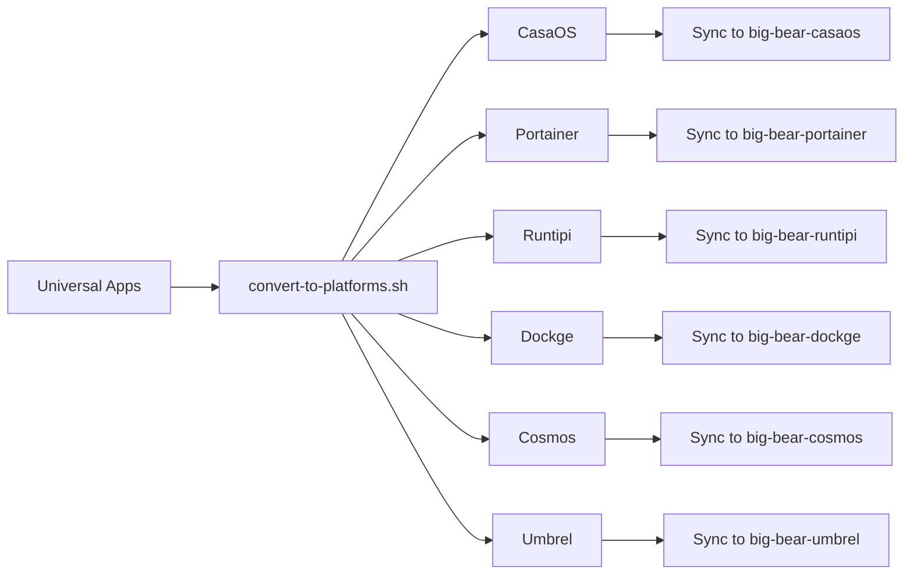

# Big Bear Universal Apps

The **Big Bear Universal Apps** repository is the **single source of truth** for all Big Bear app definitions. Apps are maintained in a universal, platform-agnostic format and automatically converted to platform-specific formats.

## 🎯 Overview

This repository serves as the central hub for Big Bear app definitions. All apps are stored in a standardized universal format and converted to various platform-specific formats:

- **CasaOS** - Home server operating system
- **Portainer** - Container management platform
- **Runtipi** - Self-hosted app platform
- **Dockge** - Docker compose management
- **Cosmos** - Reverse proxy and app platform
- **Umbrel** - Personal server OS

## 📁 Repository Structure

```
big-bear-universal-apps/
├── apps/                      # Universal app definitions (source of truth)
│   ├── jellyseerr/
│   │   ├── app.json          # App metadata and configuration
│   │   └── docker-compose.yml # Standard Docker Compose file
│   ├── plex/
│   └── ...
├── converted/                 # Platform-specific converted apps (generated)
│   ├── casaos/
│   ├── portainer/
│   ├── runtipi/
│   ├── dockge/
│   ├── cosmos/
│   └── umbrel/
├── schemas/                   # JSON schemas for validation
│   └── app-schema-v1.json
├── scripts/                   # Conversion and management scripts
│   ├── convert-to-platforms.sh
│   ├── migrate-from-casaos.sh
│   └── validate-apps.sh
├── SCHEMA.md                  # Universal format documentation
└── README.md                  # This file
```

## 🚀 Quick Start

### Adding a New App

1. **Create app directory:**
   ```bash
   mkdir -p apps/myapp
   ```

2. **Create `app.json`** with app metadata (see [SCHEMA.md](SCHEMA.md) for format)

3. **Create `docker-compose.yml`** with a clean, standard Docker Compose file

4. **Convert to all platforms:**
   ```bash
   ./scripts/convert-to-platforms.sh -a myapp
   ```

### Converting All Apps

```bash
# Convert all apps to all platforms
./scripts/convert-to-platforms.sh

# Convert to specific platforms only
./scripts/convert-to-platforms.sh -p casaos,portainer,runtipi

# Dry run (preview without making changes)
./scripts/convert-to-platforms.sh --dry-run
```

## 📝 Universal App Format

Apps in this repository use the **Universal App Format** - a comprehensive, platform-agnostic format that contains all necessary metadata and configuration.

### Key Components

1. **`app.json`** - Contains all metadata:
   - App information (name, description, version)
   - Visual assets (icons, thumbnails)
   - Technical requirements (architectures, ports)
   - Deployment configuration
   - Platform compatibility flags

2. **`docker-compose.yml`** - Standard Docker Compose file:
   - Clean, no platform-specific extensions
   - Uses relative paths (e.g., `./data`)
   - Standard Docker Compose v3+ format

See [SCHEMA.md](SCHEMA.md) for complete format documentation and examples.

## 🔄 Conversion Workflow



The conversion process:
1. Read universal format from `apps/`
2. Convert to platform-specific formats
3. Output to `converted/<platform>/`
4. Sync converted apps to platform repositories
5. Create pull requests for updates

## 🛠️ Scripts

### `convert-to-platforms.sh`

Converts universal apps to all platform formats.

```bash
# Usage
./scripts/convert-to-platforms.sh [OPTIONS]

# Options
-h, --help              Show help message
-i, --input DIR         Input directory (default: ./apps)
-o, --output DIR        Output directory (default: ./converted)
-p, --platforms LIST    Comma-separated platform list
-a, --app NAME          Convert specific app only
--dry-run              Preview without changes
-v, --verbose          Verbose output

# Examples
./scripts/convert-to-platforms.sh                    # Convert all apps
./scripts/convert-to-platforms.sh -a jellyseerr      # Convert one app
./scripts/convert-to-platforms.sh -p casaos,runtipi  # Specific platforms
```

## 🧪 Validation

Validate apps against the JSON schema:

```bash
# Validate all apps
./scripts/validate-apps.sh

# Validate specific app
./scripts/validate-apps.sh -a jellyseerr
```

## 📊 Apps

<!appsList>

## 🤝 Contributing

### App Submission Guidelines

1. **Use the universal format** - All apps must be in universal format
2. **Clean Docker Compose** - No platform-specific extensions
3. **Complete metadata** - Fill out all required fields in `app.json`
4. **Test conversions** - Ensure app converts correctly to all platforms
5. **Validate** - Run validation before submitting

### Workflow

1. Fork this repository
2. Add or update app in `apps/` directory
3. Run conversions: `./scripts/convert-to-platforms.sh -a yourapp`
4. Validate: `./scripts/validate-apps.sh -a yourapp`
5. Commit and create pull request

## 📚 Documentation

- **[SCHEMA.md](SCHEMA.md)** - Universal format specification and examples
- **Platform Docs:**
  - [CasaOS](https://github.com/bigbeartechworld/big-bear-casaos)
  - [Portainer](https://github.com/bigbeartechworld/big-bear-portainer)
  - [Runtipi](https://github.com/bigbeartechworld/big-bear-runtipi)
  - [Dockge](https://github.com/bigbeartechworld/big-bear-dockge)
  - [Cosmos](https://github.com/bigbeartechworld/big-bear-cosmos)
  - [Umbrel](https://github.com/bigbeartechworld/big-bear-umbrel)

## 🔧 Requirements

- **jq** - JSON processor
- **yq** - YAML processor (v4+)
- **curl** - File downloads
- **ImageMagick** (optional) - Icon conversion for Runtipi

### Installation

**Ubuntu/Debian:**
```bash
sudo apt-get update
sudo apt-get install jq curl imagemagick
sudo wget https://github.com/mikefarah/yq/releases/latest/download/yq_linux_amd64 -O /usr/local/bin/yq
sudo chmod +x /usr/local/bin/yq
```

**macOS:**
```bash
brew install jq yq curl imagemagick
```

## 🎬 CI/CD

Automated workflows handle:
- ✅ Validation on pull requests
- 🔄 Automatic conversion to all platforms
- 📦 Syncing to platform repositories
- 🤖 Creating pull requests in platform repos
- 🔄 Renovate bot for version updates

## 💬 Community

- **Discord:** [Big Bear Community](https://discord.gg/dExAgnrWH3)
- **Forum:** [community.bigbeartechworld.com](https://community.bigbeartechworld.com)
- **YouTube:** [Big Bear Tech World](https://youtube.com/@bigbeartechworld)

## 📄 License

MIT License - see [LICENSE](LICENSE) for details

## 🙏 Credits

Maintained by [BigBearTechWorld](https://github.com/bigbeartechworld) and the Big Bear Community.

---

**Questions?** Open an issue or join our [Discord](https://discord.gg/bigbeartech)!
